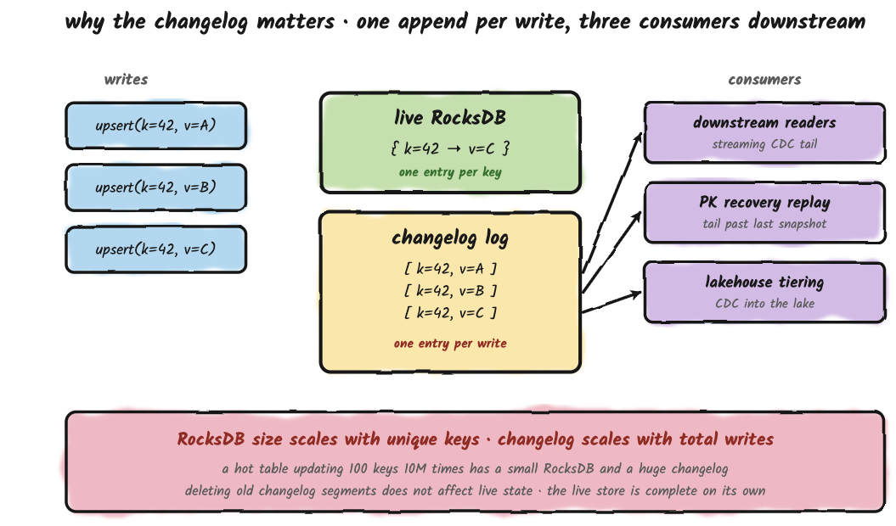
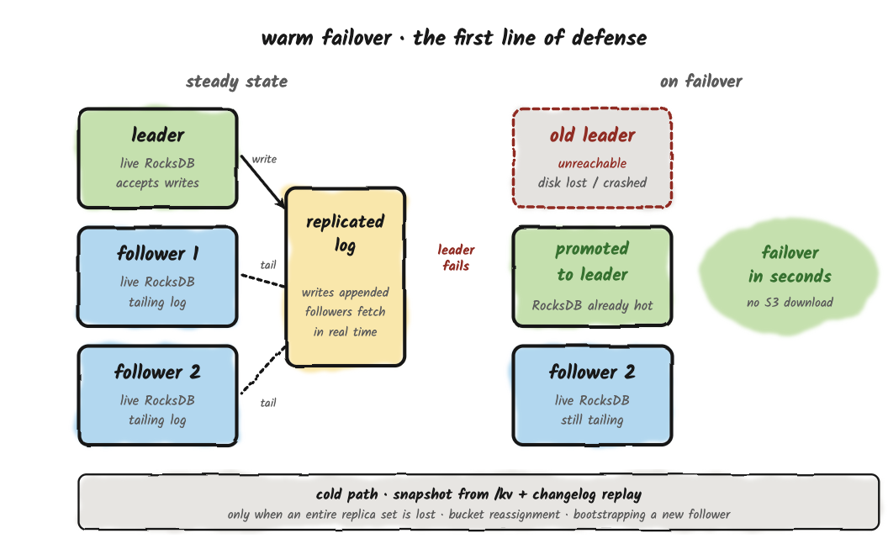
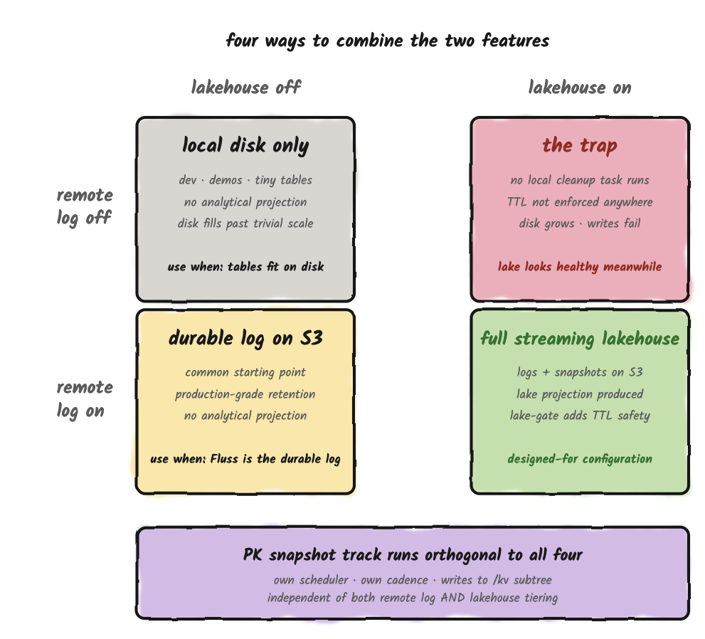

**Apache Fluss stores data in three places:** local disk on the tablet server, remote object storage like S3, and the lakehouse. Which place holds which data at any given moment, and what is responsible for moving it between them, is the foundation everything else rests on. Your capacity plan depends on it. Your latency targets depend on it. Your disaster-recovery story depends on it. So does your ability to predict, in advance, that a particular configuration change is going to fill up local disk a week later.

<!-- truncate -->

This post walks through that layering. We'll cover what each tier holds, the two background tasks that move data between them, what changes for primary-key tables, and how recovery actually works when a tablet server loses its disk. 

By the end you should be able to look at a Fluss deployment and say, for any given record, where it lives right now and where it will live in an hour.

## The Three-Tier Storage Hierarchy

**Tier 1 is local disk on the tablet server.** It holds the hot data: recent log segments, the full live RocksDB state for every primary-key table, and a staging view of the most recent KV snapshots (hard links to live SST files while uploads are in flight). Reads from this tier are in milliseconds.

**Tier 2 is remote object storage** (S3, GCS, or similar), used for two distinct purposes that share the same `remote.data.dir` filesystem. 
* **First:** older log segments uploaded by the `remote-log tiering task` in Fluss's native binary format, which extends local retention without growing local disk. 
* **Second:** durable KV snapshots for every primary-key table, uploaded periodically so that a tablet server can recover after disk loss.

Remote log storage is **enabled by default**. It's controlled by `remote.log.task-interval-duration` (default `1min`), and is only disabled when that value is set to `0`. KV snapshot upload is independent of remote-log tiering and is governed by `kv.snapshot.interval` (default `10min`). 

**Tier 3 is the lakehouse.** Paimon, Iceberg, Hudi, or Lance are holding data in analytical file formats queryable by any engine. Reads from the lakehouse cost seconds.

### A Note On Single-Copy Storage

**A Fluss table is a single logical abstraction across all three tiers, each holding data at a different freshness level.** Local disk has the hot, most recent data; remote object storage extends retention beyond what fits locally; the lakehouse holds the analytical projection. Across those tiers, each record has one home at a time and no tier permanently holds a second copy of what another tier already owns.

**There is one temporary exception**: when lakehouse tiering is enabled, a remote log segment is only deleted once **both** its TTL has expired **and** the lakehouse has ingested it. That's a safety net against lakehouse lag, and it creates a bounded transition window where the same data exists in both Tier 2 and Tier 3, governed by `table.log.ttl` (default 7 days). Shorten the TTL if minimizing that overlap matters more to you than a long lakehouse catch-up window.

Once the lakehouse catches up, the remote copy is removed and the overlap closes.

## Log Tables on Local Disk

A log table on disk is a sequence of log segments. Each segment is a `.log` file holding raw records alongside a small set of companion files: a `.index` offset index and a `.timeindex` time index for fast seek, plus per-segment writer-state snapshots used for idempotent producers. The active segment is open for appends; every other segment is immutable and named by its starting offset.

What happens to those sealed segments is governed by two retention controls.
* `table.log.ttl` (default 7 days) is the global retention contract for the log. It defines the maximum age of any log data in the table, regardless of which tier it currently lives on.
* `table.log.tiered.local-segments` (default 2) is a count-based floor for local disk, only meaningful when remote-log tiering is on. The remote-log task keeps at least this many recent segments on local disk after upload, so consumers reading near the head don't pay an S3 round-trip for the freshest data.

A segment becomes a candidate for upload **the moment it is sealed and its records are below the high watermark** (i.e., committed/acked). Sealing happens when the active segment hits its size threshold, fills the offset or time index, or can no longer encode records as relative offsets, and then rolls over: Fluss closes the current active segment (which becomes immutable) and opens a new one for subsequent writes. The freshly-closed segment is now something the remote-log task can pick up on its next pass. This is the same model Kafka uses for tiered storage, and it has the same operational consequence: **data sitting in the active segment lives only on the local Fluss server until rollover**, which means the active segment's size threshold sets an upper bound on how fresh remote-tier data can be. Anything newer than the current rollover is local-only.

### What remote-log Tiering Actually Does

By default, remote-log tiering is on (`remote.log.task-interval-duration=1min`) and TTL is 7 days. The remote-log task does three things on each pass:

1. Uploads newly-sealed segments to S3.
2. Advances the local log's `remoteLogEndOffset`, which causes the local log to trim every sealed segment now in S3, keeping at least `table.log.tiered.local-segments` recent ones.
3. Deletes S3 segments past TTL.

Local disk is bounded primarily by the count-based floor, usually a handful of recent segments. The TTL value applies most visibly on the S3 side, because S3 is where data lives the longest.

### Disabling Remote Tiering

Setting `remote.log.task-interval-duration=0` opts out of Tier 2 entirely, but this comes with an additional consequence: it also disables the scheduled cleanup task itself, because that task is what runs both the upload and the segment-deletion paths. With the task disabled, **nothing trims local segments**. **There is no automatic fallback to the lakehouse on the write path.**

The end result is **unbounded local-disk growth**. Eventually the tablet server runs out of disk and write batches start failing with storage exceptions.

## Remote Tiering and Lakehouse Tiering Are Different Features

These two features are frequently conflated, which is fair because the names suggest a relationship, but they solve different problems and produce different output.

**Remote tiering** is about disk economics on the tablet server. It copies raw log segments in Fluss's native binary format to S3, extending local retention without growing local disk. The tablet server can then read from S3 when a consumer requests an offset that has been trimmed locally. It's managed entirely server-side, by a background task. As a side effect, it's also **the only mechanism that trims local log segments**.

**Lakehouse tiering** is about analytical access. It converts Fluss data into lakehouse-native formats, like ORC, Parquet, Lance and writes them to the lakehouse via an external Flink job (the Tiering Service). The output is queryable by Spark, Trino, and Flink independently of Fluss.

These are complementary layers. You can run any combination of them. When both are enabled, the lakehouse confirmation acts as an additional safety gate on top of TTL-based S3 deletion: a remote log segment is not expired until TTL has passed and the lake has confirmed it.

## Primary-Key Tables 
A log table has one thing on disk: the log. A primary-key table has three. They serve different roles, they live in different places, and they fail in different ways. **Operating primary-key tables without seeing them as three distinct structures is one of the faster routes to a confusing production incident.**

### Structure 1: Live RocksDB Store

This is the current state of the table. One entry per primary key, always up to date, sitting on the tablet server's local disk inside a RocksDB instance. Every point lookup reads from here. Every upsert merges into here. The live store is created when the tablet opens and deleted only when the table is dropped.

Nothing moves the live store. There is no setting that puts it on S3, in the lakehouse, or anywhere else. **RocksDB on local disk is where the work happens, and that's the only place it can happen.**

The role to understand here is "what serves traffic," not "what is durably stored." **The live store is what serves traffic. What survives a disk loss is the snapshot in remote storage**, which is Structure 2. Two roles, two copies, related data. You need local disk for the full merged state of every bucket the tablet server is responsible for; **the lakehouse cannot stand in for this**, and the tablet server doesn't read PK state from the lake under any circumstance.

### Structure 2: KV Snapshots

Every ten minutes by default (`kv.snapshot.interval=10min`), the tablet server takes a snapshot of the live RocksDB and writes it to remote storage. **This is the system's only durable record of the table's merged state at a point in time.** If the tablet server's local disk evaporates, recovery begins from the most recent snapshot and then replays the changelog forward from that snapshot's offset to reach the present. The two-stage process described in the Recovery section below.

**Step one** happens locally and completes immediately. The tablet server hard-links the current RocksDB SST files into a staging directory. **No bytes are copied, just new pointers to existing files.** This is what lets a snapshot start instantly regardless of how large the table is, because nothing is being duplicated on disk.

**Step two** is the one that actually moves data. Those files, plus a bit of metadata, get uploaded to remote storage. The remote copy is the durable one; the local staging directory is there so the uploader sees a frozen, consistent view of the files while RocksDB keeps writing and compacting underneath it. The snapshot is considered durable once the upload finishes.

Fluss keeps the last two snapshots in remote storage by default. When a new snapshot supersedes an old one, the old one is deleted, with one guard: if anything (most commonly a long-running lakehouse tiering job on its first round) is still reading the older snapshot, a lease prevents the cleanup from removing it underneath the reader. This sounds like a detail, and it is most of the time. It becomes load-bearing the first time a large primary-key table takes longer to tier than the gap between snapshots, and the lease is what keeps the system from racing itself.

### Structure 3: The Changelog

Every upsert and every delete also gets appended to a log, in the order it happened. This log behaves exactly like a regular log table on disk, same retention rules, same tiering to remote storage, same handoff to the lakehouse.

Two things make the changelog different from the rest of the primary-key table.

**It grows with the number of writes, not the number of unique keys.** A primary-key table that updates the same 100 keys ten million times has a small live store and an enormous changelog. RocksDB collapses by key; the log does not. This is what makes the changelog useful as a CDC feed · downstream consumers see every change in order, not just the latest value.

**Deleting old changelog segments has no effect on the live store.** The live store is complete on its own; it doesn't need the log to know the current value of any key. The log is there for replay (when a tablet needs to recover) and for downstream feed (when something is reading change events). **It is not a place where state lives.**

> **Note:** This is a simplified version of the changelog for illustrative purposes. 

## Recovery: Independent Tracks, Coupled Outcomes

The snapshot upload track and the log upload track look independent from a configuration standpoint. Separate settings, separate schedulers, separate remote subdirectories. **They are not independent when you actually need to recover from disk loss.**

Recovery on a fresh tablet server works in two stages. The snapshot brings the live state up to whatever point it was taken at. The changelog then replays every change since that point to catch up to the current moment.

If remote-log tiering is off, that changelog tail lives only on the failed tablet server's local disk, which is the disk you just lost. The snapshot, however durably stored, can only restore the state as of its own offset. Everything written since then is gone.

**The two upload tracks are independent on the way in. The recovery story stitches them back together on the way out, and breaks if either piece is missing.**

## Standby Replicas

Everything described so far is the cold-start path; the one that runs when no other copy of a bucket is still alive. Most production recoveries aren't cold restarts.

**Fluss replicates each bucket across multiple tablet servers**: one leader handling writes, plus followers continuously tailing the same log. One of those followers is the designated **standby**, the replica the controller will promote on leader failure, and the one that maintains a live RocksDB kept current with the leader in near real time.

When the leader fails, the controller promotes the standby. **The standby's live RocksDB is already current, so traffic resumes in seconds, with no S3 download and no log replay.** The snapshot path still matters, it's the safety net when an entire replica set is lost at once, when a bucket gets reassigned to a brand-new tablet server, or when a fresh follower is bootstrapping into the cluster. But that path is the fallback, not the everyday failure handler.

This refines the framing of remote storage. Calling it the recovery substrate and the durability floor was accurate. It just isn't the recovery path you exercise most often in healthy production. **The everyday path is one replica picking up where another left off**, which is precisely why **running with replication factor 1 in production is a bad idea, however durable your snapshots are**.

## Combining Tiers

There are four ways to combine **remote-log tiering** and **Lakehouse tiering**. Three are useful; one isn't.

| Remote | Lakehouse | What you get | When to use                                                                                                                                                           |
|--------|---|---|-----------------------------------------------------------------------------------------------------------------------------------------------------------------------|
| **Off**  | **Off** | Local disk only. Bounded by physical local-disk size. | **Don't run this configuration in production :)**                                                                                                                                             |
| **On**     | **Off** | Production-grade log retention via S3. No analytical projection. | The most common starting point. Sensible when Fluss is the durable log for streaming consumers, not yet a streaming lakehouse. A good first step when adopting Fluss. |
| **Off**    | **On**  | Lakehouse works normally; local disk grows until writes start failing. The remote-log task is what trims local segments, and disabling it means nothing trims them. | **Don't run this configuration in production :)**                                                                                                                     |
| **On**     | **On**  | Full streaming-lakehouse setup. Logs are tiered to S3, snapshots are uploaded to S3, the Tiering Service produces the lakehouse projection, and the lake-confirmation gate stacks on top of TTL. | The configuration Fluss is designed around.                                                                                                                           |

The primary-key snapshot track is orthogonal to all of this. It runs on its own cadence (`kv.snapshot.interval`, default 10 minutes), writes to its own remote subdirectory (`/kv`), and is what makes primary-key tables recoverable after disk loss. **Disabling remote-log tiering does not disable KV snapshot upload.** Three independent tracks, three independent config keys · the configuration vocabulary does not make this obvious, but the runtime behavior does.

## Closing Thoughts

Fluss's storage layer is structurally simple -- three tiers, two background tasks -- and the simplicity is what makes it easy to misread. 

* **Tier 1** looks like the tier that matters, because it's the only one on the live query path. 
* **Tier 2** looks like an implementation detail, because it's **"just S3"**. 
* **Tier 3** looks like a destination, because it's the lakehouse.

Each shortcut is wrong in a way that only becomes visible after you've configured something based on it.

The model here is: three tiers with three different jobs, two background tasks that should be reasoned about independently, a small set of defaults deliberately tuned for production. 

Disabling those defaults is almost always the wrong move. Tuning them to your workload is almost always the right one. 🌊