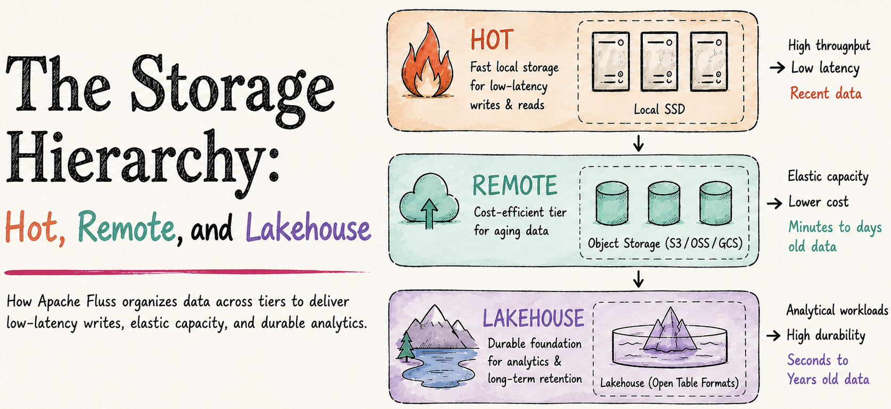
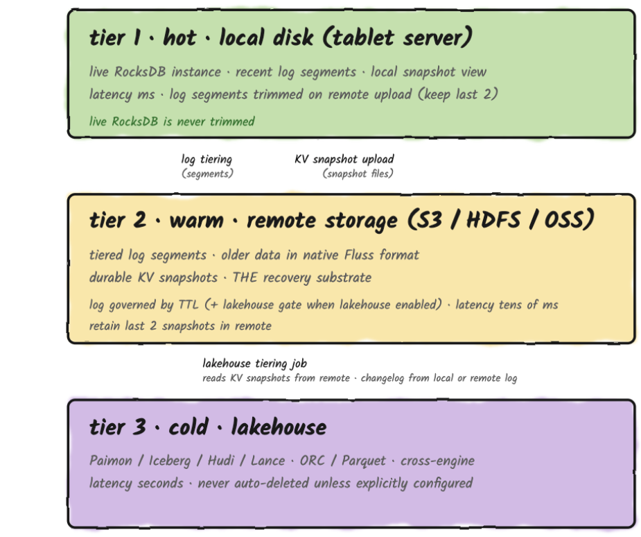
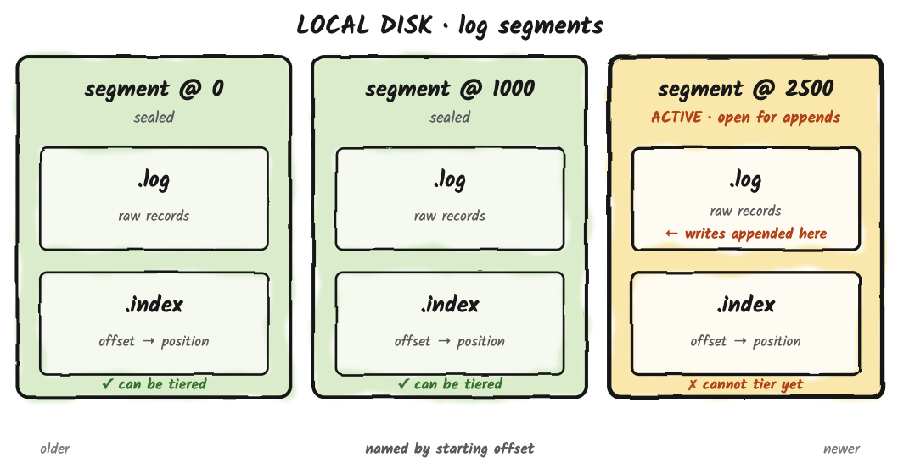
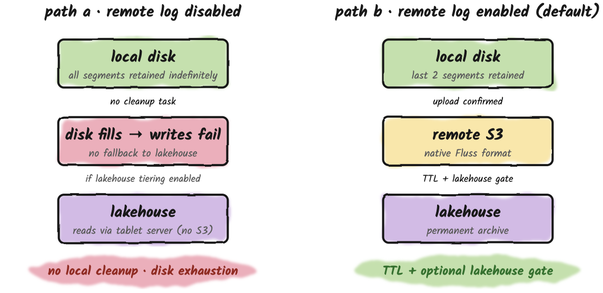
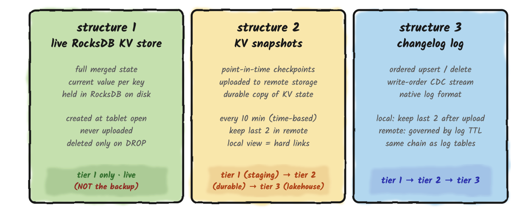

## Three-Tier Storage Hierarchy
Fluss organizes its storage into three tiers. Each tier has a different latency profile,
a different data format, and different rules governing when data can be deleted.
Understanding which tier holds which data at any moment is the foundation for
things like capacity planning, latency expectations, correct read-path design, and disaster recovery all depend on it.
<!-- truncate -->

The first tier is **local disk on the tablet server**. It holds the hot data: recent log
segments, the full live RocksDB KV state for every primary key table, and a local
view of the most recent KV snapshots (which exist as hard links to live SST files
while uploads are in flight). Reads from this tier are microseconds to milliseconds.

The second tier is **remote object storage** (like S3), used for two distinct
purposes that share the same remote.data.dir filesystem: (a) older log segments
uploaded by the remote-log tiering task in Fluss's native binary format, extending
local retention without growing local disk, and (b) durable KV snapshots for every
primary key table, uploaded periodically so that a tablet server can recover after
disk loss. Remote log storage is **enabled by default**: it is controlled by
`remote.log.task-interval-duration (default 1min)`, and is disabled only when that
value is `set to 0`. KV snapshot
upload is independent of remote-log tiering and is governed by
`kv.snapshot.interval (default 10min)` .

The third tier is **the lakehouse** (Paimon, Iceberg, Hudi (WIP), or Lance), holding
data in analytical file formats queryable by any engine. Reads from the lakehouse
take seconds. The lakehouse is never on the Fluss server's read or recovery path.

> **On single-copy storage.** Apache Fluss is single-copy in steady state: hot data on the
server, cold data in the lakehouse, no permanent duplication. 

 **The one exception:**
when lakehouse tiering is enabled, a remote log segment is only deleted once **both**
its TTL has expired **and** the lakehouse has ingested it, a safety net against
lakehouse lag. This creates a bounded window where the same data lives in both
Tier 2 and Tier 3, governed by `table.log.ttl` (default 7 days). Shorten it if strict
single-copy matters more than a long catch-up window. The overlap is a configurable,
time-bounded transition, **not another copy**.

### Four architectural contracts govern how these tiers interact.

1. Key-value lookups always hit the live RocksDB instance in **Tier 1**. The lakehouse is never consulted under any condition. 
2. **Tier 2** holds two different kinds of data: tiered log segments in Fluss's native binary format `(under {remote.data.dir}/log/)`, and KV snapshots of every primary key table `(under {remote.data.dir}/kv/)`. The tablet server uses **Tier 2** for both catch-up log reads and for restoring KV state after disk loss. Tier 2 is the actual backup of KV state. 
3. The lakehouse is a write-only sink from the Fluss server's perspective. The tablet server never reads from the lakehouse · neither for queries nor for recovery · even when the lakehouse contains a newer projection of the data than the local RocksDB instance. 
4. Union reads · which combine lakehouse and log data · happen entirely in the connector layer (Flink or Spark), not in the tablet server. Direct readers of the lakehouse files (Trino, Paimon CLI, Iceberg CLI, Hudi CLI) see only the committed lakehouse snapshot.

If you create a primary key table in Fluss, you must provision local disk for the full live KV state of every bucket on that server. 
The lake is not an automated substitute, for PK tables the lake's snapshot-plus-equality-delete data shape is in principle reconstructable into RocksDB state (the Fluss × Iceberg integration explicitly aims at this property), 
but no Fluss server code path performs that reconstruction automatically. 
The remote KV snapshot in `remote.data.dir` is your disaster-recovery substrate; recovering from it means downloading and rebuilding RocksDB from the snapshot plus changelog before the tablet can accept traffic.

## Log Table Data Lifecycle

A log table's data on local disk is organized as log segments. 
Pairs of a `.log file` (raw records) and an `.index file` (offset index for fast seek). 
The active segment is open for appends; all others are immutable and named by their starting offset. 
What happens to these segments after they are written is governed by a single retention TTL (`table.log.ttl, default 7 days`) that defines the lifetime of log data in the table, plus, when remote tiering is enabled 
and a count-based local-side override (`table.log.tiered.local-segments, default 2`) that keeps a minimum hot window on local disk regardless of TTL.

A segment becomes a candidate for upload to remote storage **only after it is sealed**.
Once Fluss closes it and stops accepting writes into it. 
The active segment, by definition, is still open, so the tiering task will not touch it. 
When the active segment hits its size threshold it rolls over: Fluss seals the current active segment (which becomes immutable) and opens a new active segment for subsequent writes. 
The freshly-sealed one is now a candidate the tiering task can pick up on its next round. 
This is the same model Kafka uses for its tiered storage. 

**The practical consequence:** data sitting in the active segment lives only on the local Fluss server until rollover, which is why the active segment's size threshold acts as a lower bound on how recent your "remote-only" reads can be.

### Two paths, one critical difference
By default, remote log storage is active `(remote.log.task-interval-duration=1 min)` and the per-table TTL `(table.log.ttl)` defaults to 7 days. 
The TTL is the global retention contract for the log and it defines the maximum age of log data in the table, regardless of which physical tier it lives on. 
When remote tiering is enabled, the remote-log task implements that contract: it uploads sealed segments to S3, trims local segments down to `table.log.tiered.local-segments` (default: 2) once they have been uploaded, and expires S3 segments past TTL. 
In this configuration the local-disk footprint is bounded primarily by the count-based keep-N floor (typically a small hot window of recent segments), and the TTL value applies most visibly on the S3 side because that is where data lives longest.

If you set `remote.log.task-interval-duration=0`, you opt out of Tier 2 entirely and you also opt out of the scheduled cleanup task itself, because that task is what runs both upload and segment deletion. 
In this mode there is no scheduled component trimming local segments. 
This is Path A, and the practical failure mode is unbounded local-disk growth: eventually the tablet server runs out of disk and write batches start failing with storage exceptions. 
There is no automatic fallback to the lakehouse on the write path. 
Running Fluss with the scheduled task disabled is meant for narrow scenarios, it is not the supported steady-state mode, which is why remote log storage ships enabled by default.

## Remote Log Storage vs. Lakehouse Tiering
These two features are independent and are frequently conflated. Each solves a different problem and has a completely different output format.

**Remote log storage** is about disk economics on the tablet server. It copies raw log segments in Fluss's native binary format to S3, extending local retention without growing local disk. The tablet server can read from S3 when a consumer requests an offset that has been trimmed locally. It is managed entirely server-side by a background task. As a side effect it is also the only mechanism that trims local log segments.

**Lakehouse tiering** is about analytical access. It converts Fluss data into lakehouse-native formats (ORC, Parquet, Lance) and writes them to the lakehouse via an external Flink job (the Tiering Service). The output is queryable by Spark, Trino, and Flink independently of Fluss.

These are not alternatives. They are complementary layers, and you can run any combination of them. When both are enabled, the lakehouse confirmation acts as an additional safety gate on top of the TTL-based S3 deletion.

## Primary Key Table Data Lifecycle
A primary key table maintains three coexisting storage structures. Each has an independent lifecycle. 
Lakehouse tiering interacts with two of them and never touches the third. Two of them are durably backed by remote storage; the third is local-only.

**Structure 1, the live RocksDB KV store**, is the authoritative, always-current, fully-merged state of all records. 
It is what point lookups read from, the target of every upsert merge, and the storage that never moves to S3 or the lakehouse. 
It is created unconditionally when a tablet opens and deleted only when the table is dropped.
**Important framing:** the live RocksDB instance is local-only, but it is not the durable backup. 
Its durable counterpart is the most recent KV snapshot in Tier 2 (Structure 2). 
The live store is what serves traffic; the snapshot is what survives disk loss. 
Provision local disk for the full merged KV state of every bucket assigned to each tablet server, plus 1.5–2× headroom for RocksDB compaction amplification. 
The lakehouse cannot substitute for this storage. 
If compaction I/O bursts compete with the write path on the same disk, `kv.rocksdb.shared-rate-limiter.bytes-per-sec` caps compaction throughput cluster-wide, it is a smoothing knob, not a disk-full fallback, and it does nothing to reduce the steady-state RocksDB footprint.

**Structure 2, KV snapshots**, are periodic checkpoints taken every `kv.snapshot.interval`. 
Snapshot creation is a two-step process: first, the tablet server creates hard links to live SST files into a local snapshot directory (this is instantaneous and what the O(number of SST files) cost refers to);
second, the `KvSnapshotDataUploader` uploads those SST files plus snapshot metadata to `{remote.data.dir}/kv/{database}/{table}-{tableId}/{bucket}/snap-{snapshotId}/` 
on the remote filesystem. 
The remote copy is the durable copy. The local hard-link directory is staging, it exists so the upload sees a consistent view of SST files while RocksDB compaction continues underneath. 
Fluss retains the last `kv.snapshot.num-retained` (default: 2) remote snapshots; older ones are deleted from remote storage when subsumed, subject to a lease check that prevents deletion while a tiering job is still reading. 
The lease check runs every `kv.snapshot.lease.expiration-check-interval` (default: 10 minutes).

**Structure 3, the changelog log**, is an ordered sequence of every upsert and delete mutation in write order. 
It follows the same retention rules as a pure log table, TTL is the global lifetime, the local side is trimmed down to the keep-N floor after upload, and S3 segments expire by TTL with an optional lakehouse-confirmation gate. 
Deleting changelog segments has no effect on the live RocksDB state, which holds the complete current value for every key regardless of changelog retention. Because the changelog grows with every upsert independent of unique-key cardinality, leaving remote log storage at its default (enabled) is effectively required in production.

> **Capacity planning rule.** RocksDB storage (Structure 1) is unbounded and grows with the number of unique primary keys. Plan local disk capacity around RocksDB size plus the expected changelog working set and keep remote log storage enabled so the changelog working set is bounded by the keep-N floor.

