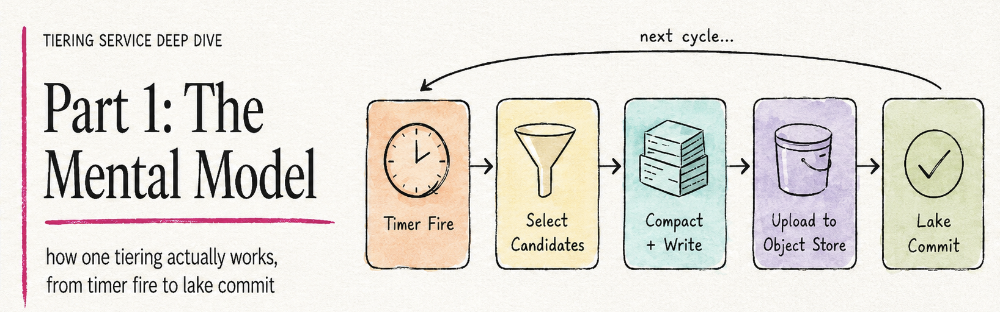
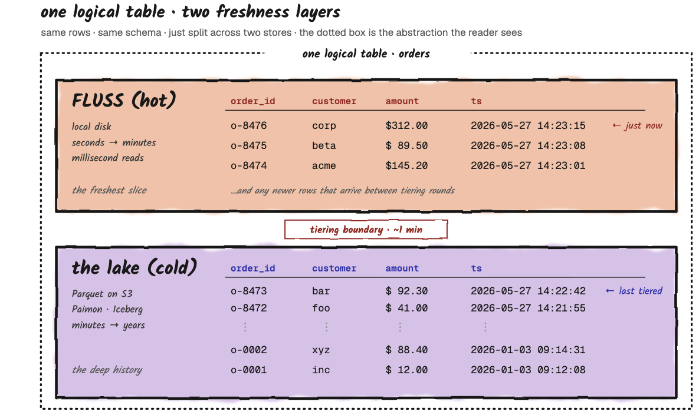
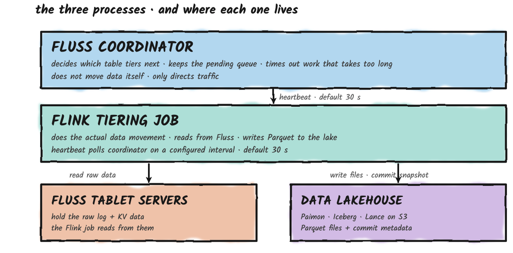
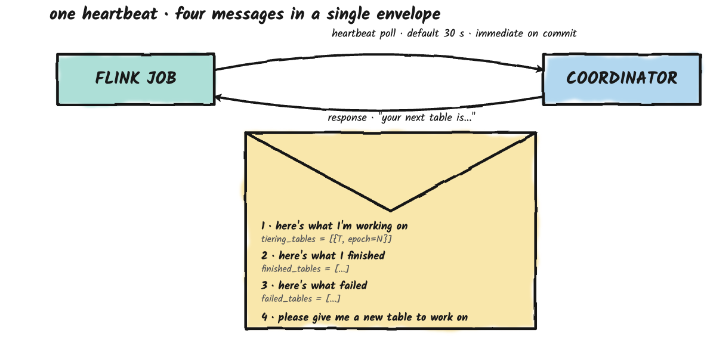
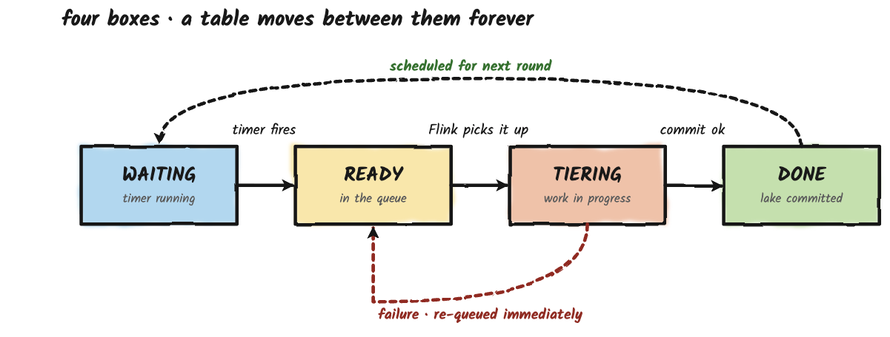
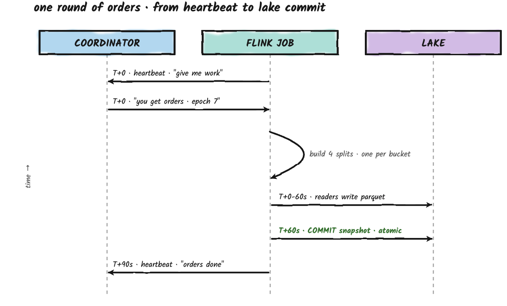

If you're new to Fluss, the lake-tiering story is one of those topics where every explanation seems to assume you already know how it works.
This three-part walkthrough aims to bring some clarity to the confusing parts of the system, and to help you understand how it works in practice. 

**Part 1** builds the mental model from scratch and by the end of it you'll be able to describe, step by step, what happens between the moment a tiering timer fires and the moment a lake snapshot is committed. 

**Parts 2 and 3** take that mental model and add the dials (parallelism, table kinds, freshness, multi-table behavior, scale-out) and then put it into a real production deployment (failures, pitfalls, monitoring).

**Tiering Service Deep Dive, 3-parts:**
* **Part 1 - The Mental Model:** how one tiering round actually works, from timer fire to lake commit. 
* **Part 2 - Tuning:** per-table dials, multi-table dynamics, and scaling out. 
* **Part 3 - In Production** failure modes, design pitfalls, and monitoring.
<!-- truncate -->

# Why tiering exists in the first place
Fluss is bounded in capacity by design and that's the entire reason the tiering service exists.
Its speed comes from keeping data on local disks attached to a small number of machines. Local disk is finite, costs money to keep spinning, and is sized for the working set, not for a year of history.
Fluss isn't your archive, it's the freshest layer of your platform. 
So old data has to leave, on a schedule, into storage designed for the long haul. **That's the job of the tiering service**.

Meanwhile, you have analysts and batch jobs and ML/AI pipelines **who don't need millisecond freshness**, but they need to query a year of orders, run a join over a quarter of clicks, train a model on six months of sessions. 
That's the job of the data Lakehouse. Parquet files on S3, organized as open table formats (Iceberg, Paimon, Hudi, Lance), queryable by `Spark`, `StarRocks`, `DuckDB`, `Trino`, `Flink-batch` or even just `Python`.

**So you have two storage layers:** the hot one (Fluss) and the cold one (the Lakehouse), **exposed as one single table abstraction with different freshness layers**, and you need something that moves data from one to the other on a regular schedule, in a way that's correct, atomic, and survives failures.
That something is the tiering service.

The tiering service does three things at once.
1. **It keeps the Lakehouse fresh:** within some configurable target like **"never more than two minutes behind"**. 
2. **It lets Fluss reclaim space:** once data is safely in the Lakehouse, Fluss can delete its own copy. 
3. **And it does both atomically:** the Lakehouse either sees a complete update or no update at all, never a half-written mess.

The tiering service is just a stateless Flink **(Spark support is also WIP)** streaming job that runs continuously. It reads from Fluss, writes Parquet files to S3, and tells the Fluss coordinator **"I committed this offset range, you can release it now."** 

Everything else in this article is about the details, but if you remember **"it's a stateless Flink job that copies data, on a schedule, in atomic batches,"** you've got the shape of it.

## The Three Processes And What Each One Does
Three processes are involved in tiering. They live in different places, they have different responsibilities, and they almost never overlap. 
Knowing which is which is half the battle of debugging anything.

### The Coordinator
The Fluss coordinator is the brain of the cluster that handles `metadata`, `leader election`, and `cluster state`. Tiering is one of its many responsibilities.
It keeps a list of which tables need to be tiered, when each was tiered last, and which one should go next. 
It does not move any data itself; it decides what runs and tracks what's in flight.

### The Flink Tiering Job
This is a stateless Flink streaming job that you deploy. It runs forever. Every so often, it calls the coordinator and asks **"what should I work on next?"**. 
When the coordinator hands it a table, the Flink job reads that table's data from the Fluss tablet servers, writes it out as Parquet files in the lake, and commits a lake snapshot. 
Then it reports back, **"done, you can mark this table as tiered"** and asks for the next one.

### The Fluss Tablet Servers
These are the Fluss processes that actually hold your data.
The tiering job reads from them but never writes to them. They mostly don't know they're being tiered, they just serve reads.

### The Data Lakehouse
S3, GCS, or whatever object store you're using. The open table format (Paimon, Iceberg, Hudi or Lance) defines how files and metadata are laid out so that query engines can read them. 
The tiering job writes here. Nobody else touches it during tiering.

> **Why Split It This Way?**
> Separating the **"who decides"** from the **"who moves"** is a deliberate design choice. The coordinator already manages cluster state. Making it also responsible for scheduling tiering is a small addition. Putting the actual data movement in Flink means you get all of Flink's benefits for free, parallelism, checkpointing, restart-from-failure, without having to build any of it from scratch.

## The Heartbeat
The coordinator and the Flink tiering job are different processes on different machines. 
They need a way to talk. They have exactly one channel: **a single RPC called the heartbeat**, sent by the Flink job to the coordinator on a configured interval (`tiering.poll.table.interval, default 30 seconds`). 
Every piece of communication between them happens inside this one call.

That makes the heartbeat a four-purpose message:

The Flink job's heartbeat carries: 
1. **What it's currently working on:** the list of tables it's tiering right now
2. **What it just finished:** tables whose Lakehouse commits succeeded since the last heartbeat
3. **What failed:** tables whose tiering blew up for some reason, and 
4. **"Give me another":** a boolean flag asking for the next table from the queue. The coordinator's response carries either a new table assignment or a **"nothing for you right now"** message.

Two things from this design that are worth remembering.

**First, the coordinator only learns about in-progress work at heartbeat boundaries**. The heartbeat cadence is for polling, **"anything new for me?**" 
Completion is different: when a table finishes (or fails), the enumerator triggers an immediate heartbeat rather than waiting for the next tick. 
So the worst-case lag of **"up to 30 seconds"** applies to mid-round status, not to commit announcements.

**Second, every message has an "epoch" number stamped on it**. Each time a table starts a new tiering attempt, its epoch goes up by one. 
If a Flink job tries to report success with a stale epoch (because the coordinator already gave up on that attempt and handed the work to someone else), the coordinator just ignores the message. 
This is how the system stays consistent even when things go sideways and we'll come back to it in **Part 3**, in the failure-modes section.

## The Life Of A Table: Four States, Walked Through
Every table that's enabled for lake tiering goes through the same lifecycle. 
The coordinator tracks each table's current state. For our purposes, four states are enough to keep in your head:

> **Note:** The actual source code uses seven state names: `NEW`, `INITIALIZED`, `SCHEDULED`, `PENDING`, `TIERING`, `TIERED`, `FAILED`. Here we collapse them into four pedagogical states to keep the mental model small.

**NEW** is only used for the very first time a lake-enabled table is created, and `INITIALIZED` is only used for tables the coordinator rediscovers after a restart. Both transition into `SCHEDULED` immediately, so we ignore them here. `FAILED` is the unhappy-path state we'll come back to in **Part 3**.

**WAITING.** The table has been tiered recently and the freshness timer is counting down. Nothing to do.

**READY.** The timer has fired. The table is now in the coordinator's pending queue, waiting for a Flink job to pick it up on the next heartbeat. It might wait a few seconds, or several minutes if there are many other tables ahead of it.

**TIERING.** A Flink job has picked the table up and is reading its data, writing Parquet files to the Lakehouse, and aiming for a commit. The coordinator has started a clock; if this takes too long, it'll time out.

**DONE.** The Lakehouse commit landed. The coordinator records **"this table was last tiered at time T"** and immediately schedules the next round. The table goes back into `WAITING`.

The happy path is just `WAITING → READY → TIERING → DONE → WAITING →` ... forever. The unhappy path, which we'll cover in **Part 3**, in the failure-modes section, is when TIERING ends in failure (timeout, reader crash, anything) and the table cycles back to `READY` without ever reaching `DONE`.

## A Complete Tiering Round, Step By Step
Three concepts are important to understand when you're reading this:
* **Bucket:** A horizontal partition of a Fluss table. If a table has 16 buckets, every record is hashed into one of the 16 by some key. Buckets are the unit of parallelism for both writes (different writers can land in different buckets) and reads. 
* **Split:** A unit of work for the Flink tiering job. Each split says **"read offsets X to Y of bucket B"**. During a tiering round, the planner generates one split per bucket of the table being tiered. 
* **Reader:** A Flink subtask that processes splits. If you set the Flink job's parallelism to 16, you have 16 readers. Each reader processes one split at a time and asks for another when it's done.

### Let's walk through a single tiering round with a concrete example.

We have one table, called `orders`, with four buckets. It's a log table (we'll talk about what that means in Part 2, when we cover table kinds. For now, just think **"an append-only stream of records"**). Freshness is configured to five minutes. The Flink tiering job is up and running. 

Here's what happens:.

#### T+0s the timer fires. 

Five minutes have passed since the last tiering round for `orders`. The coordinator transitions the table from WAITING to READY and pushes it onto the back of the pending queue. The act of entering the pending queue is also what increments the table's tiering epoch · to (say) 7 · so every fresh attempt is stamped at enqueue time, before any job has picked it up. Right now the queue contains just `orders`.

#### T+0s the Flink job sends its heartbeat. 

The job is idle, there is no work in progress, so its heartbeat says **"give me something"**. The coordinator pops `orders` off the queue, transitions it to `TIERING`, and replies **"your next table is `orders`**, epoch 7"**. The epoch was already set when the table entered the queue. `requestTable()` just reads it and hands it back, it doesn't bump it again.

#### T+0s the Flink job plans the work. 

The job's enumerator (the part of a Flink source that decides what each parallel reader will do) asks the Fluss tablet servers: **"what's the latest offset for each bucket of `orders` right now?"** Let's say the answers come back as `[bucket-0: 1,000; bucket-1: 1,200; bucket-2: 950; bucket-3: 1,100]`. The enumerator also looks up where the last tiering round left off; the **"last committed lake offset"**, let's say `[bucket-0: 990; bucket-1: 1,190; bucket-2: 945; bucket-3: 1,090]`. 
The difference is the work for this round.

#### T+0s splits are created. 

The enumerator builds four splits, one per bucket. Each split says **"read from offset X to offset Y of bucket B"**. It shuffles them randomly (so no reader always gets the heaviest bucket) and assigns one split to each of the four Flink readers running in parallel.

#### T+0s to T+60s the readers work. 

Each reader streams its assigned offset range from a Fluss tablet server and writes the records as Parquet files into a staging area in the lake. The buckets process independently and at different speeds. When a reader finishes its split, it emits a small message saying **"bucket B is done, here are the files I wrote, the last offset I read was Y"**.

#### T+60s the commit operator collects all four results.

A dedicated Flink operator called the commit operator sits at the end of the job. In the normal path it waits for results from all four buckets, then commits them together as **a single atomic lake snapshot**. This gives you a clean, all-or-nothing update to the lake table. Once it has all four, it calls into the open table format and writes a snapshot that includes all the new Parquet files plus the updated per-bucket offsets. (Force-finish, which we'll meet in Part 2, in the freshness section, is the one exception; the commit operator still waits to hear back from every bucket, but readers that ran out of time emit an empty result, and the commit only includes the buckets that did produce data. Anything skipped is picked up in the next round.)

> **One detail that's easy to miss:** the lake snapshot is durable at `T+60s`, but the coordinator hasn't transitioned the table to `DONE` yet. That happens on the next heartbeat from the enumerator.

#### T+60s the commit operator records the lake snapshot back to Fluss. 

Now that the lake snapshot is durable, the commit operator (`TieringCommitOperator`) records the new snapshot offsets into Fluss metadata through the coordinator. It delegates this to a helper, `FlussTableLakeSnapshotCommitter`, which implements a two-phase commit (prepare + commit) against the coordinator gateway rather than RPC'ing tablet servers directly. This lets the cluster know that data up to those offsets is safely in the lake and can be aged out of Fluss's hot storage when the time comes. Tablet servers learn about the new tier point through the standard metadata-propagation path, not via a direct RPC from the committer.

#### T+60s the commit operator notifies the enumerator. 

Immediately after the commit, the commit operator sends a `FinishedTieringEvent` back to the source enumerator. As we said earlier, the enumerator doesn't wait for the next 30-second poll tick. It fires an out-of-band heartbeat right away, carrying `orders` in the `finished_tables` list.
The coordinator validates the epoch (still 7, all good), records the completion time, transitions `orders` to `DONE`, and immediately schedules the next round.

#### Scheduling the next round. 

The freshness timer is computed from when the round **completed**, not from when it started. The coordinator does `delay = freshness − (now − lastTieredTime)`, and `lastTieredTime` is set to the moment the completion heartbeat is processed. So with a five-minute freshness, the next round fires roughly five minutes after the commit, i.e. at about T+360s. This is the (intentional) reason the lake always lags by at least one full freshness interval plus one round duration.

That's it. Round complete. The lake now contains `orders` data up to the offsets that were current at T+0s. In another ~five minutes, the whole process repeats.

> **The most subtle point in this section: The "stopping offset" is decided at planning time, not at reading time.** When the enumerator asks the tablet servers "what's your latest offset?" at T+0s, those answers freeze. Any records written to Fluss after T+0s but before the readers actually start working are not part of this round · they'll be picked up in the next one. This is correct behavior, but it means the lake always lags by at least one round, even if your freshness is configured aggressively.

## Next Up
You've now got the mental model, the processes, the heartbeat conversation, the lifecycle, and what happens during one full round. 
The next part takes that round and shows what changes when you start tuning the dials, and then what changes again when you stop thinking about one table at a time.

