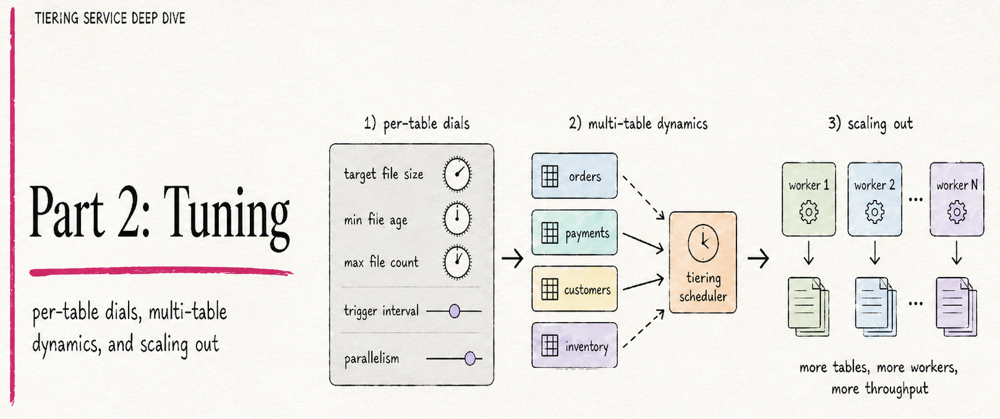
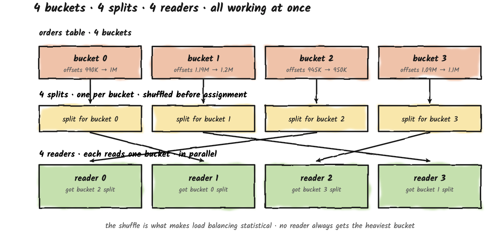
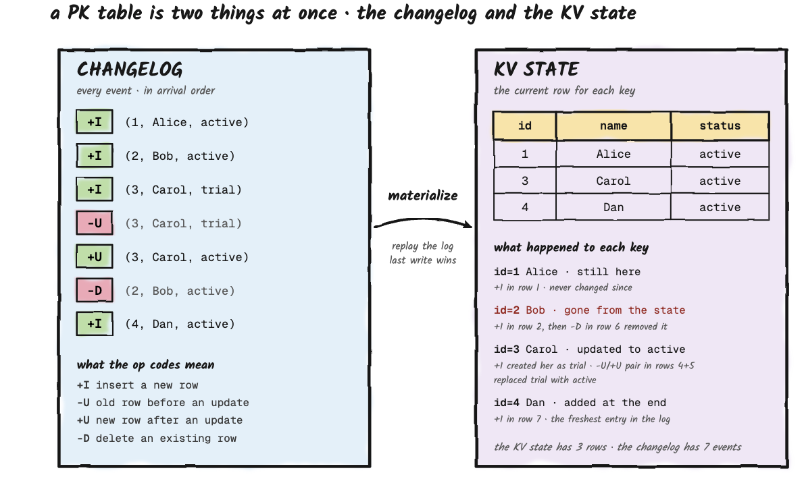
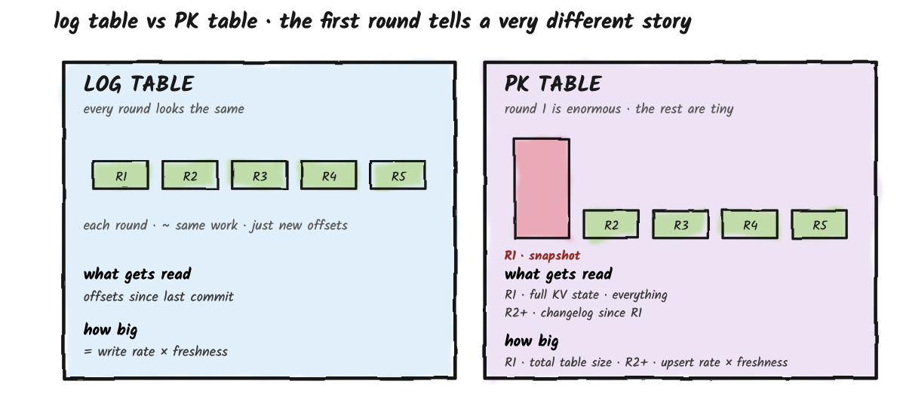
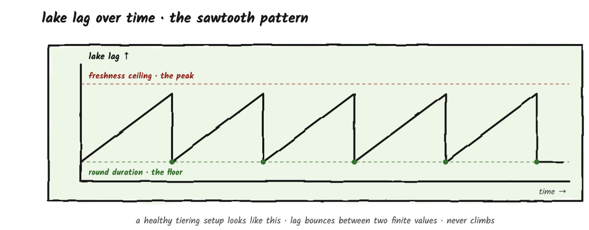
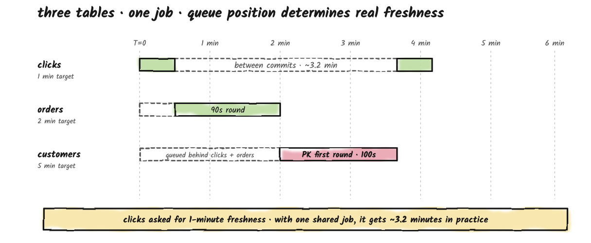
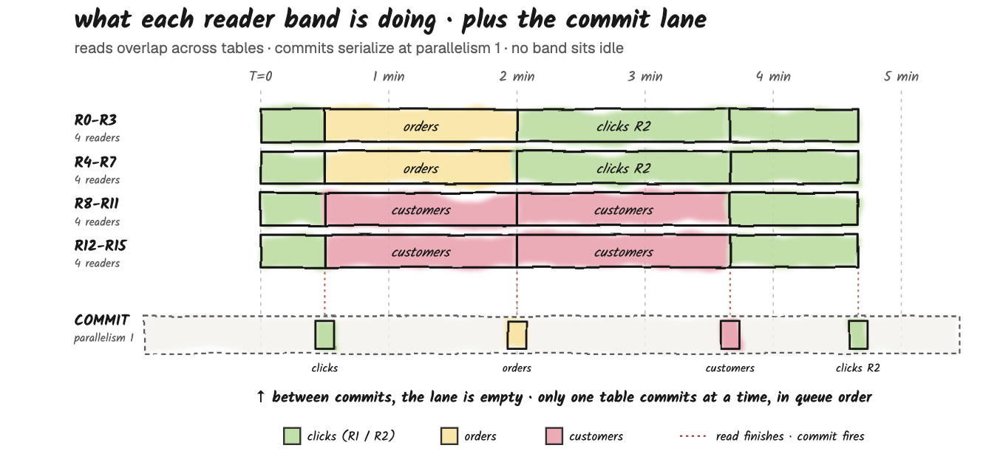
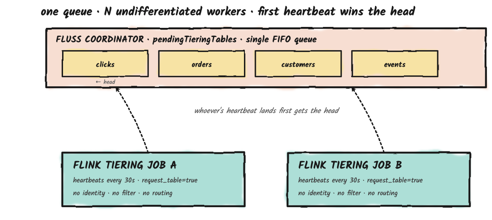

[Part 1](/blog/fluss-tiering-service-deep-dive-part1) built the mental model. What tiering is, who does what, how the round runs end-to-end. 

This part adds the dials. Buckets and splits determine how a round parallelizes. 
Log and PK tables behave so differently on round one that the difference deserves its own treatment. 
The freshness setting, the one knob most users actually touch, does two different jobs that share the same value.
Once a single job is handling many tables, queue position starts to dominate effective freshness more than any per-table setting.
And once that happens, you have a deployment-shape decision: stay with one job, or scale out. By the end, you'll know which levers matter most and how to use them.

**Tiering Service Deep Dive, 3-parts:**
* **[Part 1 - The Mental Model](/blog/fluss-tiering-service-deep-dive-part1):** how one tiering round actually works, from timer fire to lake commit.
* **Part 2 - Tuning:** per-table dials, multi-table dynamics, and scaling out.
* **[Part 3 - In Production](/blog/fluss-tiering-service-deep-dive-part3):** failure modes, design pitfalls, and monitoring.

<!-- truncate -->

## Buckets, Splits, And How The Work Gets Divided
In [Part 1](/blog/fluss-tiering-service-deep-dive-part1), we had a table with 4 buckets that ended up with 4 splits.
That's not accidental: the rule is one split per bucket.
Let's slow down and look at the parallelism story end-to-end, because this is where bucket count actually starts to matter.

The mental model is straightforward: **buckets** are how the data is physically partitioned, **splits** are the chunks of work the tiering job hands out, and **readers** are the workers that consume splits.
The number of buckets is fixed at table creation time. The number of readers is your Flink job parallelism. The number of splits per round equals the number of buckets.

What happens when the number of readers doesn't match the number of buckets? Two cases:

**More readers than buckets**. A table with 4 buckets and 16 readers means only 4 readers can work on *that* table. Bucket count caps how many readers a single table's round can use. The other 12 don't necessarily sit idle, though: if other tables are waiting in the queue, the enumerator hands those spare readers the next table's splits, and they start reading ahead (we'll see exactly how in the multi-table section). They only truly idle when there's no other work queued.

**Fewer readers than buckets**. A table with 16 buckets and 4 readers means each reader will process 4 splits sequentially. Reader 0 takes one split, finishes it, asks for the next, takes another, and so on. The whole round takes roughly 4× longer than it would with 16 readers. This is the common production case, and it's fine, just slower.

One more thing: the splits are shuffled (randomized) before being assigned. This is a small but important detail. Without it, reader 0 would always get bucket 0, reader 1 would always get bucket 1, and so on. If bucket 0 is consistently the heaviest (because of a bad key distribution), reader 0 would consistently be the bottleneck. Shuffling spreads the bad luck around: over many rounds, every reader gets stuck with the heavy bucket about equally often.

## The Slow-Bucket Effect
In the normal commit path, the commit operator waits for every split of a table before committing.
If 3 readers finish quickly and the 4th is still processing a much larger bucket, the table's commit can't happen until that last bucket lands. The 3 fast readers move on to other queued tables (or idle, if there's nothing else queued), but this table's round isn't done until its slowest bucket is.
The lake commit itself is always atomic. Readers can't see a half-written snapshot, and most of the time every bucket of a round lands in the same commit.

**The end result:** the slowest bucket determines how long a round takes. Skewed bucket keys can hurt you here. (There's one exception: when freshness fires and the round force-finishes, whatever each bucket has tiered so far gets committed, and the unread remainder rolls to the next round. We'll cover this in the freshness section.)

## Two Kinds of Tables: Log vs. Primary-Key Tables

### Log Tables: The Simple Case
A log table is exactly what it sounds like: an append-only stream. Records arrive, they get assigned an offset, and they sit there. You can't update or delete a record; you can only append. Examples: a clickstream, an event bus, an audit log.

Tiering a log table is straightforward. Every round, the Flink job reads "everything since the last commit" (just the new offsets) and writes those records as Parquet files in the lake.
The lake table grows monotonically. The work per round is proportional to how much you wrote since the last round.

### Primary-Key Tables: The Trickier Case
A primary-key (PK) table is like a row-keyed materialized view. 
Each record has a primary key and the latest value for that key replaces any previous value. 
Internally, Fluss stores PK tables in two parts: **a changelog** (a log of all the upserts and deletes that have happened) and a **KV state** (the current value for each key, derived from the changelog). It's similar to how a database has a write-ahead log plus the actual table.

The changelog records every event using four operation codes you'll see throughout the Flink and Fluss world: `+I` for an insert, `-U` and `+U` together for an update (the old row going out, the new row coming in), and `-D` for a delete. 
Apply all of those to an empty state in order and you get the current row for every key; that's the KV state. Here's a small example to make this concrete:

Now think about what **"tier this to the lake"** means for a PK table.
The lake needs the current state of every row, not just the log of what changed. 
So the very first round of a PK table has to copy the entire KV state to the lake. 
That can be huge: think 200 GB if you have a big customer-profile table.
After that first round, subsequent rounds only need the changelog records since the last snapshot offset, because the lake's merge engine knows how to apply upserts and deletes to existing rows.

The numbers here are illustrative. A 200 GB PK table might take 10+ minutes to read on its first round (because all 200 GB must be copied). 
The second round, where only the upserts and deletes from the last few minutes need to be applied, might take 30 seconds. 
This is an important difference, and the single most important thing to understand about PK tiering: the first round is in a different category from every round that follows.

### The Summary Table

| Aspect | Log Table | Primary-Key Table |
|---|---|---|
| **Round 1 reads** | Whatever offsets exist so far | Full KV state, up to 100s of GB |
| **Round 2+ reads** | New offsets since round 1 | Changelog since round 1's snapshot offset |
| **What the lake stores** | Append-only Parquet | Snapshot rows + applied upserts/deletes |
| **Cost stability** | Roughly constant per round | Round 1 huge, rest tiny |
| **Partial progress useful?** | Yes: committed buckets advance the lake; the rest roll to the next round | Round 1 snapshot: no (force-finish is ignored for snapshot splits, so they run to completion rather than committing partially). Round 2+: yes |

## The Freshness Knob
Every table that's enabled for tiering has a setting called `table.datalake.freshness`. 
It's a duration, something like `5min` or `30s`, and the default is 3 minutes.
This single number is the most common source of confusion in the tiering service, because it does two different jobs that share the same value.

### Job 1: How Often Rounds Start
The obvious meaning.
After a round completes, the coordinator schedules the next round one full freshness interval later, measured from the moment that round *finished*. So with 5-minute freshness, the next round becomes eligible 5 minutes after the previous round committed. The round's own duration is *not* subtracted.

Under the hood the scheduler computes `freshness − (now − last_completion_time)`, which looks like it deducts elapsed time. But `last_completion_time` is reset to the instant the round just finished, so the subtracted term is ~0 for back-to-back rounds. That subtraction only bites after a coordinator restart, where the last completion can be well in the past and the next round may fire immediately.

The practical consequence: the effective start-to-start cadence is `round_duration + freshness`, not `freshness` on its own. A table with 5-minute freshness and 90-second rounds runs a round roughly every 6.5 minutes, not every 5.

#### If You're Coming From a Flink Streaming Background
Tiering cadence is driven by freshness; it is **not** tied to Flink checkpoints.
A common mental model from Flink-CDC-style pipelines is "data lands in the sink when a checkpoint completes".
That's not quite how the tiering service works. A tiering round commits to the lake when all the round's bucket results have arrived at the commit operator, which is driven by the round's own progress rather than by external checkpoint cadence. 
Whatever checkpoint interval the Flink tiering job has configured doesn't bound when the lake sees new data. 
The round itself does.

The correctness story has two layers worth separating. 
Atomicity comes from the lake's own commit primitive (Paimon's snapshot commit, Iceberg's metadata swap). Consistency across attempts comes from the epoch fencing mechanism the coordinator uses, introduced in **Part 1**, in the [heartbeat section](/blog/fluss-tiering-service-deep-dive-part1#the-heartbeat), which rejects any commit from a stale attempt (an epoch-fencing error). 
So you don't need to tune Flink checkpoint settings to get correct tiering; the defaults are fine.

What you do still need is a healthy checkpoint cycle. 
The Flink tiering job is configured with a full-restart strategy because the commit operator is stateless: it holds the per-table bucket results it has collected so far only in memory (nothing is checkpointed), so if it fails those in-flight committables are lost and the whole job restarts to collect them fresh.

That's deliberate. It keeps the all-or-nothing commit semantics simple. So checkpoints aren't your tuning knob, but they do need to complete; treat the tiering job's checkpoint cycle as load-bearing infrastructure rather than something you can ignore.

### Job 2: The Ceiling On A Round's Wall-clock Duration
The less-obvious meaning. The same value also caps how much wall-clock time a single round of this table is allowed to consume before something gives. When freshness elapses mid-round, the Flink enumerator fires a force-finish: every log split that has started commits whatever it has read so far (advancing that bucket's offset), and buckets that hadn't started yet are skipped. The skipped buckets, and the remaining tail of any partially-read bucket, get re-read in the next round (which starts immediately, since the table is re-queued straight away).

This is an important nuance and worth slowing down on: **force-finish is not a failure**. It's a partial commit. On the coordinator side, the table transitions `Tiering` → `Tiered` (with a `force_finished` flag) → `Pending`. It is not marked `Failed`. It does take a fresh tiering epoch on the way back into the queue: the `Tiered` → `Pending` transition bumps the epoch exactly as any normal re-enqueue does, but that's ordinary re-attempt bookkeeping, not a failure recorded against the table.
The lake snapshot that lands contains every bucket that tiered any data this round, each up to wherever it reached, and that snapshot is still atomic. Readers never see a partial commit. Buckets that never started just roll forward to the next round.

**One exception to highlight:** for the first round of a PK table, assuming a KV snapshot already exists (the normal case), that round reads the snapshot, and force-finish is suppressed for snapshot splits. (If no KV snapshot has been taken yet, the first round instead reads the changelog from the earliest offset as ordinary log splits, and force-finish applies as usual.)
The reason force-finish is suppressed is that a snapshot split has to be read in full to yield the log offset that the snapshot ends at, and that offset is what anchors the next incremental round.
Truncate the snapshot read part-way and you lose that offset. There's nothing for the following round to start from. 
So when freshness fires during a PK snapshot round, the force-finish signal is sent but the snapshot reader simply ignores it; the splits keep running until the snapshot finishes naturally. 
The lake commit lands whenever that happens, no matter how much longer it takes. Force-finish only meaningfully truncates work on log splits, not snapshot splits.

### What The Freshness Gives You And What It Doesn't
Freshness is a target scheduling cadence, not a guarantee of how stale the lake is.
The actual lake lag is the time between when a record is written to Fluss and when it appears in the lake, and it oscillates in a sawtooth. The floor is one `round_duration`: a record written just before a round's cutoff lands in the lake about one round-length later. The peak is roughly `freshness + 2 × round_duration`: a record written just *after* a round's cutoff has to wait a full freshness interval for the next round to start, then that round's duration to commit. So a table with 5-minute freshness and 90-second tiering rounds gives you a lake that's between ~90 seconds and ~8 minutes behind.

So the rule of thumb to take away is: floor lag ≈ `round_duration`, and peak lag ≈ `freshness + ~2 × round_duration`, meaningfully more than the configured freshness once rounds get long.
If your stakeholders say "the lake must never be more than 10 minutes behind", work backwards from the peak: with 90-second rounds, a freshness around 7 minutes keeps peak lag near 10 minutes (7 min + ~3 min). Leave yourself margin.

### The Other Timeout You Should Know About
There's a second timeout, set on the coordinator side and applied to every table regardless of its freshness. It's a 2-minute window, but the thing it measures is easy to misread. It's *not* a ceiling on how long a round can run; rather, it's a ceiling on how long the coordinator will wait between heartbeats from the Flink job about a given in-flight table.

The coordinator runs a background sweep every 15 seconds. 
For every table currently in `Tiering`, it checks `currentTime - lastHeartbeat`. 
If that delta exceeds 2 minutes, the table is fenced and transitioned through `Failed` back to `Pending`, epoch bumped, any uncommitted lake files orphaned. 
The `lastHeartbeat` timestamp gets refreshed on every heartbeat from the Flink job that mentions the table, which by default is every 30 seconds (controlled by `tiering.poll.table.interval`).

So in a healthy Flink job, the 2-minute timer never fires for round duration. 
The job heartbeats four times in every 2-minute window, each heartbeat lists the in-flight tables, the coordinator's `lastHeartbeat` stays fresh, and a single round can keep running for an hour without the coordinator ever raising an eyebrow. 
The 2-minute window only catches Flink jobs that have genuinely stopped heartbeating; GC pause long enough to look like unavailable, network partition, JobManager crash, that kind of thing.

### The Two Ceilings, Side By Side
**Freshness** is set per table, fully tunable, and triggers a force-finish on log splits when it fires mid-round. 
For PK snapshot splits, force-finish is ignored and those splits run to completion regardless, because the snapshot read has to finish to produce the log offset that anchors the next incremental round.
**The 2-minute coordinator window** is hardcoded and applies to every table, but it measures heartbeat liveness, not round duration. 
A healthy Flink job that heartbeats every 30 seconds can spend hours on a single round without ever triggering it. 
The 2-minute window is the coordinator's safety net for a job that has actually stopped responding, which is the only failure mode that needs it.

## Multiple Tables: How The Queue Actually Works
Up until now we've talked about one table. Real deployments have many. So what happens when you have, say, three tables (two log tables and one PK table) all sharing a single tiering Flink job?

The coordinator keeps one FIFO queue of pending tables. When a Flink job asks for work via heartbeat, the coordinator pops the table at the front of the queue and hands it over.
The Flink job works that table's buckets in parallel and asks for the next table once its splits are all handed out. The coordinator gives out work one table per request. As we'll see, a job's spare readers can start a second table's reads before the first table's commit lands; what stays strictly one-at-a-time is the commit.

This means the effective freshness for any single table is not just its own configured freshness. 
It's also a function of where it sits in the queue and how long the tables ahead of it take.

## A Concrete Walkthrough: Three Tables, One Job
Here's the setup. Three tables sharing one Flink tiering job that's running with parallelism 16 (so up to 16 readers can run in parallel at any moment).
Each table has its own bucket count, freshness target, and expected per-round duration:

| Table | Type | Buckets | Freshness | Round duration |
|---|---|---|---|---|
| clicks | Log | 16 | 1 min | ~30 s |
| orders | Log | 8 | 2 min | ~90 s |
| customers | PK | 12 | 5 min | ~100 s first round, ~20 s after |

Each table generates one split per bucket per round, so a clicks round produces 16 splits, an orders round produces 8 splits, and a customers round produces 12 splits. 
When the Flink job processes clicks, all 16 of its readers are busy on it at once.
orders has only 8 buckets, so at most 8 readers can work on orders itself, but the other 8 don't idle: once orders' splits are all assigned and none are left pending, the enumerator pulls the next queued table and hands its splits to those readers, which start reading ahead. Same with customers (12 buckets): the 4 spare readers pick up whatever is next in the queue.
The bucket count is a per-table cap on *intra-table* parallelism (how many readers one table's round can use), not a cap on how busy the job is. The spare readers pipeline onto the next table (detailed in *Reads Pipeline: Commits Serialize*, below). What stays strictly one-table-at-a-time is the *commit*, not the reads.

### What Determines Round Duration?
Before we walk through the example, let's pin down what "30 seconds" or "100 seconds" actually means, because those numbers aren't magic.
They emerge from three concrete inputs that every round has to negotiate with:

1. **How much data the round has to read**. For a log table, this is the volume of writes since the last commit, roughly `write_rate × time_since_last_commit`. The longer the gap between rounds, the more data each round has to move. For a PK table's first round, the data is the entire KV state; every key in the table, regardless of how long it's been since the last anything. For a PK table's incremental rounds (round 2 and beyond), it's just the changelog records since the last snapshot offset, which is typically much smaller than the full state.
2. **How parallel the work is**. Bucket count bounds the parallelism within a single round. With 16 buckets, the work is split 16 ways. With 4 buckets, it's split 4 ways, no matter how many Flink readers you have. The Flink job's parallelism setting only matters up to the bucket count of the table currently being tiered for that table's own splits; any extra readers don't wait around: they pick up the next queued table's splits (more on that in a moment).
3. **How fast each reader can move data**. Bounded by network throughput from the Fluss tablet servers, deserialization speed, and write bandwidth to the lake (S3, GCS, etc.). Real-world numbers are usually a few tens of MB/s per reader.

**Putting it together:** `round_duration ≈ data_to_read / (bucket_count × per_reader_throughput)`. 
For our clicks table, which has been collecting writes for ~1 minute, has 16 buckets, and each reader pulls maybe 30 MB/s, a round of a few hundred MB of new clicks events takes roughly 30 seconds. 
For customers' first round, the full KV state, let's say a few GB, 12 readers at 30 MB/s would take around 100 seconds. The exact numbers depend on your workload, but the shape of the formula is what matters: more buckets shortens a round, more data lengthens it.

**One important thing this formula leaves out:** the slowest bucket determines when a round can commit, because the commit operator waits for all of them.
If your bucketing key has bad distribution and one bucket holds 3× the data of the others, that one bucket sets the round duration: the other 15 readers finish their splits early and move on to the next queued table, but this table's commit still waits on that one straggler.
The `shuffle` on split assignment doesn't fix this; it just makes the bad bucket land on a different reader each round.

A newly created table doesn't tier immediately; it waits one freshness interval before its first round (the coordinator schedules it: `New` → `Scheduled` → `Pending`). So picture **T=0** as the moment all three tables have passed that initial wait and are sitting in the coordinator's pending queue, each awaiting its first-ever round. They entered the queue as each table's first scheduling timer fired, in ascending freshness order, so it reads `[clicks, orders, customers]`.

The Flink job's first heartbeat asks for work and gets clicks.
The enumerator generates 16 splits (one per bucket), shuffles them, and assigns one to each of the 16 readers. 
All readers work in parallel; clicks finishes at **T=30s**.

At **T=30s**, the Flink job asks for more work. It gets orders. The enumerator generates 8 splits and assigns them to 8 readers.
The other 8 readers don't sit idle: with orders' 8 splits assigned and nothing left pending, the enumerator immediately pulls the next table and those readers begin reading ahead (this is the read pipelining we detail below). What we're tracking in this walkthrough is the *commit* order, and orders is the table committing next: it tiers for about 90 seconds and its commit lands at **T=120s**, comfortably inside its 2-minute freshness window.

Now customers is next in the commit order. The enumerator generates 12 splits (since this is round 1 of a PK table, these are snapshot splits reading the full KV state). 12 readers can work on its splits at once; the 4 spare readers, again, pick up whatever's next in the queue rather than idling. The round takes roughly 100 seconds, and customers' commit lands at **T=220s**, well inside the configured 5-minute freshness.

But notice one thing here. clicks committed at **T=30s**; with a 1-minute freshness, its next round was scheduled for **T=90s**, so it's been waiting in the queue since **T=90s**. Its reads may well start earlier (spare readers can pick up clicks round 2 while customers is still being read), but its *commit* can't land until orders and customers have committed ahead of it.
So clicks' round-2 commit doesn't land until around **T=220s**, putting its actual lake lag near 3.2 minutes despite being configured for 1-minute freshness.
The fact that clicks uses all 16 readers when it does run didn't help. The constraint isn't how fast any one table reads; it's that the job dispatches one table at a time off the FIFO queue and commits one table at a time through a single-parallelism operator. Here clicks round 2 is re-queued only at **T=90s**, behind orders and customers, so it's both dispatched and committed last.
The configured freshness value is the target; the queue is the constraint.

**There's also a sizing lesson here**, but it's subtler than "don't over-provision." It's tempting to think that setting Flink parallelism to 16 wastes slots whenever a table has fewer than 16 buckets (8 for orders, 12 for customers). It mostly doesn't: because spare readers pipeline onto the next queued table, those slots get spent reading ahead as long as there's a backlog. Parallelism above your largest table's bucket count isn't automatically wasted: with several tables queued, the extra readers stay busy on other tables' reads. It only goes to waste when you rarely have more than one table's worth of work in flight at once.

What parallelism *can't* fix is the commit path. The commit operator runs at parallelism 1 and serializes one table at a time, so no amount of extra parallelism speeds up the rate at which lake snapshots actually land.

**A reasonable rule of thumb:** set Flink parallelism at least as high as the largest bucket count of any single table (so your biggest table can use all its buckets in one round), and add more only if you routinely have several tables queued and want their reads to overlap. Size bucket counts at table-creation time based on each table's data volume and freshness target. And if you need more *commit* throughput than one job can deliver, that's the cue to run multiple tiering jobs (next section), not to crank up parallelism.

### Reads Pipeline: Commits Serialize
The diagram above shows when each table commits.
The reads underneath those commits don't line up the same way; when a table doesn't have enough splits to keep all 16 readers busy, the Flink enumerator pulls the next table from the queue and the spare readers immediately start chewing through its splits. 
So reads overlap across tables. Commits don't.

The mechanism is simple. The enumerator maintains one shared `pendingSplits` list across all in-flight tables plus a set of `readersAwaitingSplit`. It asks the coordinator for the next table only when both `pendingSplits` is empty and at least one reader is idle. While clicks (16 splits) is running, that pair of conditions never holds simultaneously: all readers stay busy until the splits drain together at **T=30s**. But the moment orders (8 splits) is assigned, 8 readers are idle and `pendingSplits` is empty, so the enumerator immediately pulls customers from the queue, and those 8 idle readers start chewing through customers' snapshot splits while orders is still being read. The same pattern repeats when orders finishes: the freed readers pick up the remaining customers splits and then clicks round 2 (which has entered the queue by then), so customers and clicks round 2 overlap during phase 3.

The commits, however, can't overlap. The commit operator runs at parallelism 1 by design, processing one table's commit at a time. It commits a table the moment it has collected all of that table's bucket write results for the round, so commits land in completion order, not coordinator-queue order: a later-dispatched but faster table can reach the committer first and commit before an earlier, slower one when their reads overlap. What is guaranteed is that commits never run concurrently, lake snapshots land strictly one after another. In our example the rounds happen to complete in queue order (clicks saturates all 16 readers and finishes first, then orders, then customers), but that ordering is a property of this workload, not a promise the committer makes.

That's why queue position still dominates effective freshness, even with read overlap. clicks' round-2 reads can start while customers is still being read, but every commit is serialized through the single committer subtask, so a table's commit can't land until whatever the committer is currently working on is done. The lake-side appearance of "the round committed" is bottlenecked by the commit operator, not the readers, which is the exact mechanism the commit timeline was measuring.

### The General Rule
For N tables sharing one tiering job, the effective worst-case freshness of any single table is roughly the sum of all the tiering round durations, not the configured value of that one table. Configured freshness is more of a target; the queue is the constraint.

This is fine when your tables are similar in size and freshness. It's a disaster when you mix tiny fast tables with huge slow ones. The little ones get starved while the big one finishes.

### The Escape Hatch
There's a clean fix: run more than one tiering job. The coordinator's pending queue is a shared resource, and any Flink tiering job that's registered with the cluster can pull from it. Two jobs, two tables tier at once. Three jobs, three. The starvation pattern softens as soon as the number of concurrent jobs is at least as large as the number of latency tiers you actually care about. The next section is the operational walkthrough.

## Scaling Out: Running Multiple Tiering Jobs
**The previous section left us with a clean problem statement:** one Flink tiering job serializes work across all tables, so freshness for any one table is bounded by the queue depth ahead of it. 
The available knob for scaling out is to run multiple Flink tiering jobs against the same Fluss cluster. 
It works, but it's a blunter instrument than you might hope. 
The current implementation gives you concurrency, not isolation, and the section below walks through exactly what's in the code and what scaling out can and can't do.

### The Architectural Approach
Up to **Fluss 0.6**, the tiering service was a single stateful Flink job. 
The per-table sync offset, the last lake-committed offset for each bucket, was stored inside Flink's checkpointed state.
Practically, that meant you could scale the one job up (more parallelism, more slots) but you couldn't run two jobs; they would have stomped on each other's state.

**Fluss 0.7** [re-architected the service to be stateless](https://cwiki.apache.org/confluence/display/FLUSS/FIP-1%3A+Fluss+Lakehouse+Storage+Design). 
The sync offset moved from Flink state into Fluss metadata. The coordinator owns it, durably, regardless of which Flink job most recently tiered a given table. 
The `TieringSourceReader` is now explicitly stateless and its `snapshotState` returns an empty list by design. 
All the truth about "where is this table in its tiering history" lives in Fluss, not in any particular Flink job.
That single change is what makes horizontal scaling safe at all. Two jobs can both ask the coordinator "what's next?", and neither holds state that the other could clobber.

### The Mechanics: One Queue, Undifferentiated Workers
The coordinator maintains **exactly one in-memory FIFO queue** of pending tables; `pendingTieringTables` in `LakeTableTieringManager`. 
When a heartbeat comes in carrying `request_table=true`, the coordinator's `requestTable()` just pops the head: `Long tableId = pendingTieringTables.poll()`. 
There's no filter parameter, no caller identity, no routing logic. 
The protobuf `LakeTieringHeartbeatRequest` doesn't carry any "which job am I" field, because the concept doesn't exist on the coordinator side.

So from the coordinator's perspective, every Flink tiering job is indistinguishable. 
There's no job ID, no database filter, no notion of "this table belongs to that job".
All registered jobs are undifferentiated workers reaching into the same queue, and the head of the queue goes to whoever happens to heartbeat first. If you have two jobs, two tables can be in `Tiering` at the same time. If you have five, five can. But you cannot pin clicks to job A; the coordinator wouldn't know how to honor that pin even if you asked.

The epoch mechanism from [Part 1's heartbeat section](/blog/fluss-tiering-service-deep-dive-part1#the-heartbeat) keeps this safe regardless of how many jobs are running. Each table assignment carries a `tiering_epoch` stamped on it. If two jobs somehow ended up working on the same table (a rare edge case during coordinator failover, mainly), the coordinator only accepts the commit whose epoch matches its current record; the other is rejected with an epoch-fencing error. So multiple jobs running concurrently can never produce duplicate commits or corrupt lake state; the worst case is some wasted reader work that doesn't get committed.

## The Earlier Example, With Two Jobs
Let's revisit the previous walkthrough with two tiering jobs instead of one. The setup is unchanged. Three tables: clicks (1-min target, 30s round), orders (2-min target, 90s round), and customers (5-min target, 100s first PK round). At **T=0** all three are sitting in the queue: `[clicks, orders, customers]`.

**T=0s**. Both jobs heartbeat asking for work. Job A's heartbeat happens to land first and gets clicks. Job B's request gets orders (now head of queue). Both jobs work in parallel; the queue contains just customers.

**T=30s**. Job A finishes clicks, asks for next, and gets customers. Job B is still working orders.

**T=90s**. Job B finishes orders, asks for next. Queue is empty, so Job B is briefly idle. At the same moment, clicks' 1-minute freshness timer fires (last commit at **T=30s**). It enters the queue. Job B picks it up on its next heartbeat (≤30s later).

**T=120s**. Job B finishes clicks round 2. Effective freshness gap for clicks: about 90 seconds, against a 1-min target. Compare with ~3.2 min on one job.

**T=130s**. Job A finishes customers first round. Cold tier idle until the next freshness firing 5 minutes later.

| Table | Configured | Effective (1 job) | Effective (2 jobs) |
|---|---|---|---|
| clicks | 1 min | ~3.2 min | ~1.5 min |
| orders | 2 min | ~2 min | ~2 min |
| customers | 5 min | ~5 min | ~5 min |

The improvement is real, but notice it's stochastic, not architectural. Job A got clicks first only because its heartbeat happened to arrive first at **T=0**. You cannot promise "clicks always lands on the responsive job."

In practice the pairing tends to be sticky: once a job has been running short rounds it keeps becoming idle first and keeps picking up the next short round, so over time you do see something close to "fast job handles fast tables." But it's an emergent property of round timing, not a configured guarantee: if the workload shape shifts (a previously fast table grows, a slow table is dropped, a new heavy table is enabled), the pairing reshuffles on its own. Don't lean on it as if it were a guarantee.

### What Scaling Out Fixes And What It Doesn't
**Scales:** queue throughput (with N jobs, up to N tables can be in `Tiering` simultaneously); failure-domain separation (if one job crashes, the others keep tiering against the same Fluss cluster); and capacity headroom (bursts of "many tables freshly ready at once" get absorbed across multiple jobs rather than stacking up serially behind one).

**Does not scale:** any single table's round duration. If customers' first PK round takes 100 seconds with 12 buckets and one job, it still takes 100 seconds with two jobs, because only one job is working on customers at a time. Multiple jobs give concurrency across tables, not within one. The lever for a single round is bucket count and per-job parallelism, not job count.

**Does not give you:** deterministic routing. There is no current Fluss configuration that lets you say "this table goes to Job A, that one to Job B." The coordinator cannot tell jobs apart; they're identical to it. If you need hard isolation between latency tiers, the current options are limited:

**Does not bypass:** the 2-minute heartbeat-liveness window from the freshness section. Every job is subject to the same hardcoded check: if any one job stops heartbeating, the coordinator fences its in-flight tables and another job picks them up. Scaling out doesn't change this; it just spreads the heartbeat burden across multiple JobManagers.

## What's Next?
You now know all the dials, from per-table settings like bucket count and freshness, through the multi-table queue dynamics, to the deployment-shape choice between one tiering job and several. 
Everything you've read so far has been about how the system behaves. [Part 3](/blog/fluss-tiering-service-deep-dive-part3) is about what you do with it.

