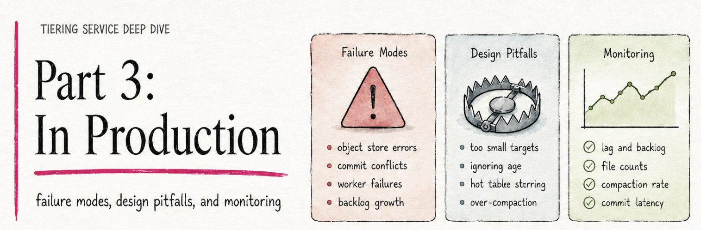
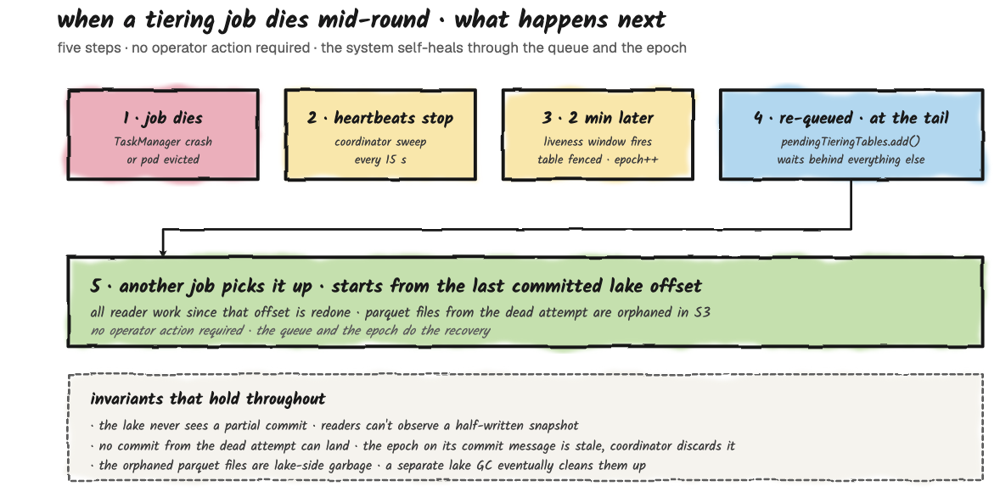
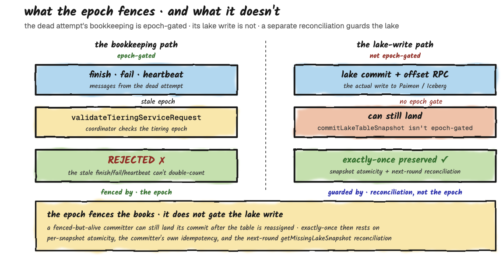
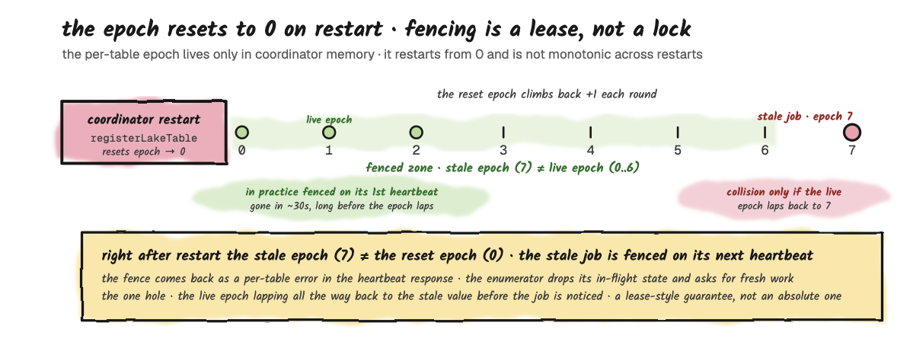
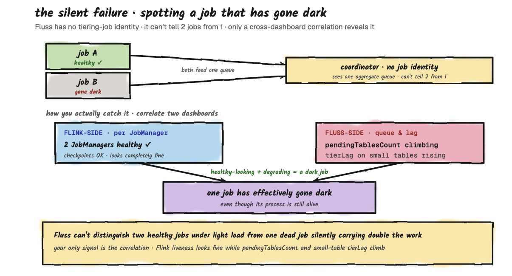

[Part 1](/blog/fluss-tiering-service-deep-dive-part1) and [Part 2](/blog/fluss-tiering-service-deep-dive-part2) built up everything you need to know about how tiering behaves: the mental model, the dials, the queue dynamics, the scale-out story. This part is about what to do with all of that. What breaks at runtime, and which of those failures self-heal versus need operator action. The design mistakes that look fine on day one but come back to bite you on day two. And the operator's daily view: which five numbers tell you whether tiering is healthy on a Tuesday afternoon, where each one comes from, and why two of them can only come from your Flink-side dashboards.

**Tiering Service Deep Dive, 3-parts:**
* **[Part 1 - The Mental Model](/blog/fluss-tiering-service-deep-dive-part1):** how one tiering round actually works, from timer fire to lake commit.
* **[Part 2 - Tuning](/blog/fluss-tiering-service-deep-dive-part2):** per-table dials, multi-table dynamics, and scaling out.
* **Part 3 - In Production:** failure modes, design pitfalls, and the dashboard that tells you everything is fine.

<!-- truncate -->

## Failure Modes: What Self-Heals And What Doesn't
The tiering service has a small number of well-defined failure modes, and the design absorbs most of them gracefully. The point of this section isn't to enumerate every edge case. It's to give you a mental model for what self-heals and what doesn't, so when something goes wrong you know whether to wait, restart, or escalate.

### The Tiering Job Dies Mid-Round
This is the most common failure and the easiest to reason about. Job A is halfway through tiering `orders`: readers have written some Parquet files, but the writer hasn't completed the lake commit yet. The Flink TaskManager crashes, or the JobManager loses leadership.

From Fluss's perspective, heartbeats stop arriving. Roughly two minutes later (the 2-minute liveness threshold from [Part 2](/blog/fluss-tiering-service-deep-dive-part2), plus up to one 15-second checker tick, so detection lands at about 2 to 2.25 minutes), the coordinator declares the job dead, fences its in-flight assignment, and returns `orders` to the back of the pending queue, where it waits behind whatever else is already queued. The next tiering job to heartbeat picks up the table at the front of the queue, which may or may not be the fenced table, depending on what else was waiting. The interrupted writer's Parquet files in the lake are orphaned; they're committed to neither Fluss nor the lake catalog, so no reader will ever see them. They sit until an external lake-side garbage collector cleans them up.

The new job starts the round from the last committed lake offset, not from where the dead job left off. **That's the cost:** all the work since the last commit is redone. **The benefit:** you never get a half-committed table.

Three invariants hold throughout this recovery:

* **The lake never sees a partial commit.** Readers can't observe a half-written snapshot.
* **The redo cannot be double-counted into Fluss.** The epoch fences the heartbeat path: the dead attempt's finish, fail, and heartbeat messages carry a stale epoch and are rejected by the coordinator (`validateTieringServiceRequest`). This fences the bookkeeping, not the lake write itself; the lake commit and the offset-advance RPC are not epoch-gated. Exactly-once into the lake is instead protected by per-snapshot atomicity plus a reconciliation check on the next round (`getMissingLakeSnapshot`), which detects and repairs the case where the lake advanced but Fluss didn't.
* **The orphaned Parquet files are lake-side garbage.** They rely on an external lake-side garbage collector to clean them up; as of the Fluss version this series tracks, there is no Fluss-side reaper for orphaned lake files.

These invariants assume the dead job stopped before its lake commit. A job that is fenced but still alive (a JobManager GC pause, or a JobManager-to-coordinator partition that doesn't affect the committer) can still complete its lake commit after the table was reassigned, because that write carries no fencing token derived from the 2-minute lease. In that narrow case, exactly-once depends on the lake committer's own idempotency.

**Call to action:** If it's Kubernetes or any restart-on-failure scheduler there is no required action. The job comes back, registers, and pulls from the queue normally. The 2-minute fencing window is your only real cost.

### A Reader Fails Inside A Healthy Job
A single TaskManager dies while the JobManager keeps running. This isn't a localized restart: the tiering job runs with a full-restart failover strategy, so one failed task restarts the entire job, readers, enumerator, and committer together. The in-flight round's partial work, which lives only in memory, is thrown away.

After the restart, the enumerator re-registers with the coordinator and asks for fresh work; it does not resume the table it was tiering. That table stays in `Tiering` on the coordinator until the same ~2-minute liveness timeout from the job-death case fences it (`Failed` to `Pending`, epoch bumped) and re-queues it. So a reader failure collapses into the same recovery path as a dead job: full restart, then the interrupted table waits out the ~2-minute fence before it is picked up again. What the surviving JobManager buys you is a faster restart of the job process, not faster recovery of that one table. No progress is lost and nothing double-commits, because the durable record of completed rounds lives in Fluss metadata (committed lake offsets).

**Call to action:** nothing; it self-heals. Watch the job's restart count and the Fluss-side `tierLag` and queue depth: a healthy recovery is a brief restart followed by `tierLag` settling back down.

### The Fluss Coordinator Restarts
The coordinator holds the queue and the per-table assignment state in memory. When it restarts, the queue empties and the assignments are dropped. The durable truth lives in Fluss's persistent metadata (ZooKeeper for table-level configuration, with committed lake offsets recorded through the lake-snapshot commit path). On restart, `initWithLakeTables` rebuilds the in-memory state from cluster metadata and, importantly, resets every table's epoch counter to 0 as part of `registerLakeTable`.

Right after restart, any job that was mid-round holds a non-zero epoch, so its next heartbeat is fenced with `FencedTieringEpochException` (returned as a per-table error in the heartbeat response, which the enumerator treats as "throw away in-flight state and ask for fresh work"). One caveat worth knowing: this epoch lives only in the coordinator's memory and restarts from 0, so it is not monotonic across restarts. Fencing here relies on the stale job being detected and reassigned before the per-table epoch happens to climb back to the same value: in practice fine, but it's a lease-style guarantee, not an absolute one.

Practically, any tiering job that was mid-round when the coordinator restarted loses its assignment, and the next freshness firing re-enqueues the affected tables. That can mean a freshness lag of up to the per-table target on the worst-affected table, but no data loss: the writes that were in flight just hadn't been committed to the lake yet, and they'll be re-tiered on the next round.

**Call to action:** nothing on the tiering side. Coordinator availability is the broader story; in HA mode another coordinator takes over. The tiering jobs reconnect to the new leader through the same metadata path as everything else.

### The Asymmetric Failure: Two Jobs, One Healthy
You're running two tiering jobs (the scale-out pattern from [Part 2](/blog/fluss-tiering-service-deep-dive-part2)). Job A is healthy; Job B is in a crash loop because of some error. What happens?

From the coordinator's perspective, Job B's heartbeats stop arriving. After roughly two minutes (the same 2-minute threshold plus up to one 15-second checker tick), the coordinator fences whatever Job B was holding. Job A picks up the slack: everything Job B would have done now flows through Job A. Effective throughput drops from two-job back to one-job behavior, with the queue-starvation pattern returning if your workload has the mixed-size shape.

This is the silent failure mode worth watching for. If you scaled out specifically to unblock a small table from a large one, and one of your jobs goes dark, the small table's freshness gets worse without anything obviously broken on the Fluss side. The challenge is that Fluss itself doesn't track tiering-job identity (as we saw when scaling out), so the coordinator cannot tell you **"I expected 2 jobs and only see 1"**. The monitoring signal has to come from your Flink-side dashboards (per-JobManager liveness, checkpoint health) combined with the Fluss-side queue and lag metrics from the operations section. If your Flink dashboard shows two healthy JobManagers but `pendingTablesCount` is climbing and `tierLag` on small tables is degrading, you have evidence that one of the jobs has effectively gone dark even if its process is alive.

### The Pattern: What Self-Heals And What Doesn't
Anything that's transient and respects the 2-minute liveness window self-heals: job crashes, network blips, reader restarts, coordinator failover. Anything structural (a bad catalog credential, a missing Iceberg table, a misconfigured lake bucket) will crash-loop your tiering job and not affect Fluss's hot tier at all. The hot tier keeps accepting writes regardless of lake health. **Your cluster doesn't break when tiering breaks; it just stops aging out.** That's the design's most important safety property, and also the reason monitoring the tiering side separately from the Fluss side matters.

## Common Mistakes: What To Avoid In Production
This section is the failure-modes section's sibling. Not **"what breaks when the system is healthy"** but **"what looks fine but is actually about to break"**. None of these will crash your cluster. All of them produce slow, expensive, or surprising behavior down the road. Worth catching at design time rather than three months in.

### Mistake 1: Sizing Buckets For The Wrong Dimension
The most common one. You pick bucket count based on ingest throughput: **"we have 200K writes/sec, give it 32 buckets"**. That sizes hot-path throughput just fine. What you didn't size for is the tiering round, which is per-bucket parallelism on a single Flink job. With 32 buckets, your tiering job needs 32 reader slots to run in parallel, otherwise the round serializes. And with 32 readers, the Flink-side write to the lake fans out to 32 concurrent writers, which means 32 concurrent S3 PUTs per round.

And bucket count isn't something you can walk back: in current Fluss there's no online ALTER path to change a table's bucket count at all. It's part of the table's distribution, fixed at create time, not an alterable `table.*` property, so for both log and PK tables you're committing to the count you pick at creation. PK tables make this constraint conceptually sharper still: the hash function that assigns rows to buckets depends on the count, so even if a future release exposed a reshard, changing the count would invalidate every existing key's placement. 

**The practical takeaway:** pick a bucket count at table creation time that reflects your steady-state volume, not your peak burst. Eight buckets handle a lot of throughput when the tiering round is healthy, and you'll thank yourself later when the round time stays predictable. For most tables, fewer buckets is better, until you have measured evidence that ingest is bucket-bound.

### Mistake 2: One Tiering Job For Everything
Covered at length in the multi-table and scale-out sections of [Part 2](/blog/fluss-tiering-service-deep-dive-part2), but worth repeating as a discrete anti-pattern: deploying one tiering job and pointing all 50 of your tables at it. It works, for a while. Then one table grows, its round duration extends, and every other table's effective freshness silently degrades because the queue gets longer. The fix when it bites is to scale out to multiple jobs, but the better play is to think about workload mix at the design stage. If you know you have a heavy table and a hot table, plan for two jobs from day one. The cost is two Flink deployments instead of one, which is marginal on most clusters. The benefit is that one bad week of growth on the heavy table doesn't take out your latency SLO on the hot one.

### Mistake 3: Confusing Freshness Target With Freshness Guarantee
The `table.datalake.freshness` config is the **"the maximum amount of time that the datalake table's content should lag behind updates"**, but it's also a **"target freshness"**. Those aren't the same thing. The coordinator schedules the next round as a re-enqueue delay (`freshness − (now − last_tiered)`), so freshness controls how often a table becomes eligible to tier again, not a hard ceiling on how stale the lake can get. **Under queue contention, the **"maximum"** is aspirational, not enforced.** If the queue ahead of your table is empty and the round is fast, you'll get something close to 1 minute. If the queue is full of bigger tables, you'll get whatever you get; the multi-table walkthrough in [Part 2](/blog/fluss-tiering-service-deep-dive-part2) goes through this case in detail.

This can look confusing when users, set up dashboards that read directly from the lake and expect **"1-minute freshness"** to mean **"data is never more than 1 minute behind real time"**. It can mean that under light load. 

Under realistic load it means **"this table is allowed to be re-tiered as often as every minute, queue permitting"**. If you genuinely need bounded freshness on a lake-side read, your options are: read from Fluss directly, or scale out tiering jobs to make sure your table never queues.

### Mistake 4: Enabling Lake Tiering On A Tiny Table
This one isn't so much a mistake as a waste. You have a `dim_country` table with 200 rows, updated once a month. Someone enables `table.datalake.enabled = true` on it because **"we tier everything"**. Now your tiering job is scheduling rounds on this 200-row table at the configured freshness cadence, each round writing a Parquet file that's mostly metadata overhead, each commit allocating a snapshot in the lake catalog. The lake-side Parquet directory fills up with thousands of tiny files. Compaction will eventually clean them up, but in the meantime your S3 LIST operations are paying for them and your catalog has thousands of unnecessary snapshot entries.

For small, slow-changing reference tables, the correct play is usually to keep them in Fluss only (no lake tiering) and let lake-side queries do a join through the union-read path. Or, if they really need to be in the lake, materialize them once via a batch job and refresh on a much longer cadence. The tiering service is the wrong tool for low-velocity data.

### Mistake 5: Ignoring The Cross-Table Effects Of Compaction
The Fluss-specific hook is simple: because tiering parallelism is per-bucket, each round writes at least one Parquet file per bucket. So a 16-bucket table tiering at 1-minute freshness produces on the order of 16 small files a minute, roughly 960 an hour and 23,040 a day, per table. That count compounds fast.

Everything past that point is standard lakehouse behavior, not a Fluss bug: small files degrade reads and bloat catalog metadata, and both Iceberg and Paimon lean on compaction to claw it back, which isn't free and isn't always automatic. The takeaway for a tiering deployment is just to size and schedule compaction deliberately rather than discover it reactively.

### The Pattern: A Production-Readiness Checklist For Tiering
Before you call a tiering deployment production-ready, walk through:

1. Bucket counts are sized for round duration, not just ingest throughput, and you've explicitly defined that at table creation time.
2. Tables of similar round duration are grouped onto the same tiering job; tables of dissimilar round duration are split across jobs.
3. Freshness targets reflect what you actually need at the lake-tier read path, not **"we just tier everything"**.
4. Compaction is configured on the lake side and you have a dashboard showing file count and snapshot count growth.
6. You have Flink-side liveness monitoring on every tiering job you deployed (see the operations section on why Fluss itself can't tell you a job has gone dark).

## What To Monitor: The Operator's View
The previous sections covered design-time decisions and failure-mode reasoning. This one is about the running system: what to look at on a Tuesday afternoon when you're trying to figure out if tiering is healthy, slow, or quietly broken. The tiering service exposes its state through a combination of Flink metrics, Fluss coordinator metrics, and the lake catalog itself. 
It's worth knowing which metrics matter.

### What The Fluss Coordinator Actually Exposes
A short list of the metrics actually registered in `LakeTableTieringManager`, so you know what you can build alarms against without inventing things.

#### Cluster-level:

* **pendingTablesCount:** how many tables are waiting in the pending queue right now.
* **runningTablesCount:** how many tables are currently in `Tiering` (that is, assigned to some tiering job).

#### Per-table:

* **tierLag:** milliseconds since the last successful tiering of this table.
* **tierDuration:** wall-clock duration of the last completed tiering round.
* **pendingTime:** how long this table has been waiting in the pending queue right now.
* **failuresTotal:** a counter of total tiering failures observed for this table.
* **fileSize / recordCount:** cumulative lake-side size and record count after the last round.
* **freshness:** the per-table configured freshness, in milliseconds.

### Round Duration
If you only watch one number, watch per-table `tierDuration` against the table's configured freshness. This is the metric that tells you whether your freshness targets are realistic. If `orders`'s configured freshness is 2 minutes and its observed `tierDuration` is 90 seconds, you have headroom. If `tierDuration` is 110 seconds and creeping up week over week, you have a problem coming.

Build a per-table dashboard. The pattern you want to see is `tierDuration` < `freshness`, with stable variance round over round.

### Queue Depth
`pendingTablesCount` is the leading indicator of starvation. In a healthy system, the queue is usually short (0 to 2 tables): tables enter, get assigned, get committed, exit. When the queue starts growing (5 tables pending, then 10, then 15), you're past the point where adding tables can keep up with tiering throughput. Either tiering rounds are slowing down, or tables are being added to the cluster faster than they're being drained, or one of your tiering jobs has effectively gone dark.

This is your cue to scale out tiering jobs (the multi-job pattern), or revisit bucket counts, or investigate a sick job. By the time freshness misses are showing up in the lake, queue depth has been climbing for hours. Watch it ahead of the symptom.

### Remote-Tier Storage Growth
It's tempting to assume a broken lake tier shows up as hot-tier (local) disk filling on the tablet servers. It usually doesn't. Local disk is bounded by `table.log.tiered.local-segments` (default 2): older local segments are continuously moved to the remote log tier no matter what the lakehouse tiering service is doing. The remote-log tier and the lakehouse tier are two independent mechanisms.

What actually grows when lake tiering stalls is the remote log tier. With `table.datalake.enabled`, Fluss won't delete a TTL-expired remote segment until it has been tiered to the lake: cleanup only frees segments whose log end offset is at or below the lake-synced offset. So a stuck lake tier overrides `table.log.ttl`, expired segments pile up in remote storage, and your object-store footprint for that table's log climbs even though local disk looks fine.

So the signal to watch is remote-tier storage size, not local disk. Remote log storage that keeps growing and never drops after `table.log.ttl` should have expired it, combined with a climbing `tierLag`, is the most direct "the lake side is failing" sign you have. For a table with no lake tiering enabled, `table.log.ttl` alone bounds remote growth and there's nothing lake-specific to watch here.

The operator's dashboard is five tiles, each answering one question. If all five are green, tiering is healthy. If any is red, the section it points to tells you where to look.

| Tile | Question | Where it points if red |
|---|---|---|
| 1. `tierDuration` / freshness | Is any round time near its target? | Freshness and queue dynamics |
| 2. `pendingTablesCount` | Is the queue growing? | Scale out, queue starvation |
| 3. Remote-tier storage growth | Is TTL cleanup blocked by a stalled lake tier? | Lake outage, stuck commits |
| 4. Lake-side file count | Is compaction keeping up? | Compaction misconfigured |
| 5. Flink JobManager liveness | Are all deployed jobs still up? | Asymmetric failure pattern |

**The rule that ties it together:** four of these tiles come from Fluss and the lake catalog. Tiles 1 and 2 are Fluss coordinator metrics, tile 3 is the Fluss remote-log tier's storage footprint, and tile 4 comes from the lake catalog. Only tile 5 has to come from your Flink-side dashboard: because Fluss has no notion of tiering-job identity, no Fluss metric can answer "are all my deployed jobs still up?" That's why tile 5 lives outside Fluss, and why monitoring tiering means wiring both sides into one view.

### The Pattern: The Five-Number Daily Check
A complete daily-operations view of the tiering service is five numbers:

1. Per-table `tierDuration` vs freshness: is anything trending toward the limit?
2. `pendingTablesCount`: is it growing?
3. Remote-tier storage growth: is TTL cleanup stuck behind a stalled lake tier?
4. Lake-side file count growth: is compaction keeping up?
5. Flink-side JobManager liveness for every tiering job you provisioned: does it match what you deployed?

If all five are green, the tiering service is healthy. If any of them are red, the previous sections tell you where to look next. That's the whole operator's playbook for this subsystem.

## Where To Go From Here
This three-part walkthrough was deliberately scoped to the tiering service, the mechanism that moves data from Fluss's hot tier into the lake. There are three adjacent topics worth exploring next, in roughly increasing order of depth.

**Reading from the lake side.** The whole point of tiering is to make data queryable from Flink batch, Spark, Trino, or any other engine that speaks Paimon or Iceberg. The union-read path, which seamlessly stitches together lake-side historical data with Fluss-side hot data, is what makes this useful. It's separate machinery from the tiering service, but it depends on it.

**Compaction on the lake side.** Mentioned several times across this series as a downstream concern. The actual mechanics of Paimon's compaction (full vs minor, the role of the dedicated compaction job) and Iceberg's (rewrite manifests, expire snapshots) are their own topics. If you're going to operate tiering in production, you need to operate compaction alongside it; they're a pair.

**Schema evolution.** The tiering service handles schema changes by carrying the Fluss-side schema through to the lake on the next round. The lake-side catalog needs to accept the new schema; Paimon and Iceberg both support evolution, but with different rules. The interaction between Fluss schema changes (`ALTER TABLE` on the streaming side) and lake-side schema (the corresponding Paimon or Iceberg evolution) has its own corner cases and is worth a separate walkthrough.

The tiering service is the kind of subsystem that's invisible when it works and confusing when it doesn't. The goal of this walkthrough was to give you the mental model that lets you reason about it without having to dig back through the source every time something looks off.
