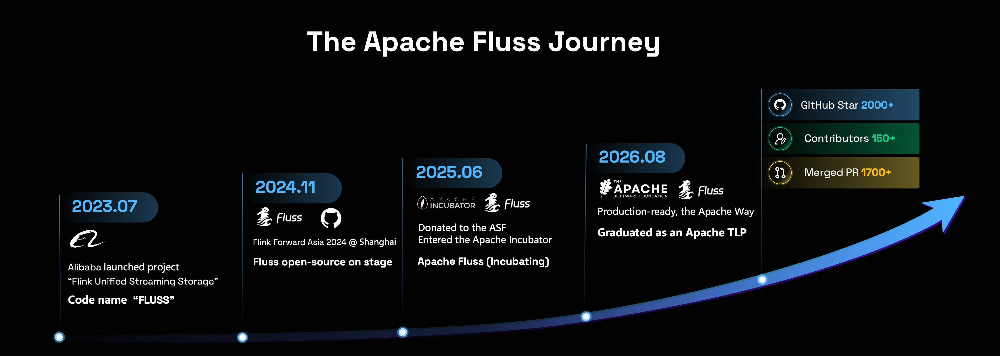
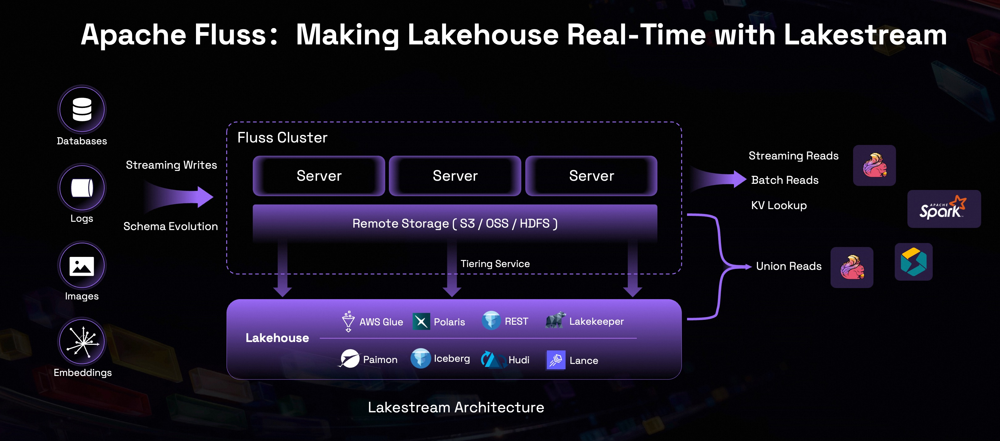

As [officially announced by the Apache Software Foundation](https://news.apache.org/foundation/entry/the-apache-software-foundation-announces-new-top-level-project-apache-fluss), we are thrilled to share that **Apache Fluss** has graduated from the Apache Incubator to become a **Top Level Project (TLP)**.

The project's [graduation proposal](https://lists.apache.org/thread/kltvfrklyoqm9dj6dgwdzf82sm097427) received unanimous approval from the Apache Incubator Project Management Committee (IPMC) and was subsequently approved by the ASF Board of Directors. This milestone not only marks a new stage in Fluss's journey, but also further advances the convergence of streaming storage, the real-time Lakehouse, and AI data infrastructure—opening a new chapter for real-time data infrastructure.

<!-- truncate -->

## How We Got Here

Fluss was initiated by the Flink team at Alibaba Cloud in July 2023 to address long-standing challenges in streaming storage for analytical workloads, including unified streaming and batch storage, Flink state management, and complex data pipelines. Its goal was to build a unified streaming storage system for real-time analytics in the Lakehouse era. The name “Fluss” comes from **Flink Unified Streaming Storage** and also means “river” in German, reflecting the vision of data flowing continuously like a river before eventually joining the open Lakehouse.

After more than a year of development and large-scale production use within Alibaba, Fluss was officially open-sourced at Flink Forward Asia 2024 in Shanghai in November 2024. In June 2025, Fluss entered the Apache Incubator, evolving from a technology initiative originating at Alibaba into an open source project built by developers around the world.

During incubation, both the contributor community and interest in the project continued to grow. Today, the community includes **157 contributors**, and the project has earned **2,000+ stars on GitHub**, merged **1700+ pull requests**, bringing together developers from different countries and organizations in an active open source community.

At the same time, Fluss has been deployed in production at **Alibaba, Xiaohongshu (RedNote), Fresha, JD.com, Ant Group, iQIYI, and other companies**. It is used across log collection and analytics, real-time data warehousing, search and recommendation, indexing pipelines, and real-time feature serving. These deployments help organizations reduce cross-system data copies, lower real-time data processing and storage costs, and improve Lakehouse data freshness and analytical efficiency.

"When we started Fluss, I believed strongly in the problem we were solving, but the project has grown faster and reached further than I expected," said **Jark Wu, PMC Chair of Apache Fluss**. "The energy of the community and the growing number of companies running Fluss in production have been especially encouraging. Graduation is a new beginning, and I am confident Fluss will become a foundational real-time data layer for lakehouse architectures and AI applications that depend on fresh, continuously updated data."

## An Open Data Foundation for Real-Time Analytics and AI

Apache Fluss is a Lakehouse-native streaming storage system for real-time analytics and AI. It connects continuous data streams, real-time updated tables, and historical Lakehouse data through a unified real-time data layer.

- **Efficient columnar streaming storage:** Built on the Apache Arrow columnar format, with server-side column pruning and pushdown capabilities, Fluss reduces data reads and transfers for efficient streaming analytics.
- **Real-time updates and low-latency queries:** Primary-key tables natively support streaming updates, partial updates, changelogs, key-value lookups, and Delta Join, allowing the same real-time data to serve both computation and point queries.
- **Stream and Lakehouse unification:** Fluss continuously tiers real-time data into open Lakehouse formats such as Apache Paimon, Apache Iceberg, and Lance, combining data freshness with cost-efficient long-term storage under a unified table abstraction.
- **An open ecosystem with multi-language access:** Fluss works with compute engines such as Apache Flink, Apache Spark and StarRocks and provides Java, Rust, Python, and C++ clients, making it easy for real-time analytics and AI applications to connect.

## Growing Community and Adoption

In the year since joining the Apache Software Foundation, Fluss has built an active global contributor community and received broad interest and support from leading companies and open source ecosystem partners.

**Feng Wang, Head of Open Data Platform at Alibaba Cloud:** “Apache Fluss’s graduation reflects a mature community shaped by open, collaborative governance at the ASF. Deployed and proven at scale in Alibaba’s core e-commerce production workloads, Fluss’s Lakestream architecture unifies streams with Lakehouse data, making the Lakehouse real-time while reducing duplication and pipeline complexity. This led us to open-source and donate Fluss to the ASF. I look forward to Fluss becoming the open data foundation for the real-time Lakehouse, advancing analytics and AI across the open data ecosystem.”

**Yu Li, ASF Member and Mentor in the Incubator Program:** “Congratulations to the Apache Fluss community on reaching this important milestone and becoming an ASF Top-Level Project. Serving as the project’s champion, I have been delighted to see Fluss grow into an open and collaborative community guided by the Apache Way. During incubation, the community delivered substantial releases, advanced streaming storage for real-time analytics, and steadily welcomed new contributors. I look forward to seeing Fluss build on this strong foundation in its next chapter.”

**Igor Kersic, CTO at Ververica:** “I'm truly excited to see Fluss graduate and become a top-level ASF project. It marks the beginning of next evolution of streaming landscape, but it's real power is in unlocking orders of magnitude more business value in streaming analytics. The design choices are just a perfect mix for one stop native streaming storage combined in just one project. My expectations is for it be de-facto foundation streaming storage go-to standard in real-time AI era. I see quicker than expected enterprise adoption due to it's power to collapse costs of complex lakehouse landscapes, thus enterprise maturity is important.”

**Jiangjie Qin, Principal Staff Software Engineer at LinkedIn:** “Congratulations to Fluss on its successful graduation! As a unified storage layer that brings together streaming, lakehouse, and key-value store capabilities, Fluss has demonstrated unique and significant value in the data infrastructure ecosystem. Over the past year in the Apache Incubator, the Fluss community has grown rapidly and healthily, and the project has demonstrated remarkable momentum. Its graduation to an Apache Top-Level Project is a well-deserved milestone. Wishing Fluss continued success as it grows into another flagship project in the data infrastructure ecosystem.”

**Jingsong Li, Apache Paimon PMC Chair:** “Apache Paimon's original vision included a serving and acceleration layer that would keep data moving, but for a long time that part of the vision remained unrealized. With the launch and continued development of Apache Fluss, this acceleration layer now brings sub-second data freshness to the Lakehouse, making it truly real-time and unified. Congratulations to Fluss on its graduation!”

**Han Liu, Head of Fluss and Kafka at Xiaohongshu:** “As an early adopter and contributor to Fluss, Xiaohongshu is delighted to have witnessed and participated in the community's journey from incubation to graduation. Fluss's columnar reads and writes, hot and cold data tiering, and Stream-Lakehouse unification have delivered significant value in core workloads such as Xiaohongshu's indexing data pipelines, substantially reducing real-time pipeline costs while improving data build and online consumption efficiency. We look forward to the Apache Fluss community continuing to thrive, creating value in more enterprise real-time data scenarios, and establishing Fluss as an important open source project for the next generation of real-time data infrastructure.”

**Emiliano Mancuso, VP of Architecture and Data Engineering at Fresha:** "At Fresha, Apache Fluss is deployed in production as part of our real-time data platform. Its combination of low-latency streaming access and open Lakehouse integration helps us simplify data movement and build fresher analytical and operational data products, while capabilities such as Delta Join make our Apache Flink pipelines simpler to operate. We are proud to contribute directly to the project and look forward to helping shape its next chapter as an Apache Top-Level Project."

**Peibin Wang, Senior Big Data Expert at Taobao Instant Commerce:** “Fluss has redefined the paradigm of real-time data infrastructure. Innovations such as Delta Join and Stream-Lakehouse unification mean that streaming storage is no longer simply an alternative to message queues, but an indispensable real-time data layer in the Lakehouse architecture. As an early and deeply involved adopter of Fluss, Taobao Instant Commerce is proud to have used Fluss to systematically address state growth and pipeline complexity at the scale of hundreds of billions of events, while reliably supporting core real-time decision-making pipelines during major campaigns such as the 618 shopping festival. We look forward to Fluss unlocking even greater value in the AI × Data era!”

**Fei Han, Head of the Real-Time Data Platform at JD Retail:** “By starting with streaming storage, Fluss opens up new possibilities for data infrastructure in the era of real-time analytics and AI. JD.com is combining its broad range of business scenarios with active participation in Fluss's technical development and community building, helping its capabilities take root in enterprise environments. Becoming a Top-Level Project is a new beginning. We look forward to Fluss continuing to embrace open innovation, growing its global developer ecosystem, and helping more organizations unlock the value of their data!”

**Xin Wang, ASF Member and Head of Real-Time Intelligence at Ant Group:** “Fluss has steadily evolved around streaming storage into an important open source project connecting stream processing and the Lakehouse ecosystem, earning increasingly broad industry adoption. Ant Group is also actively exploring and deploying Fluss. We look forward to Apache Fluss continuing to foster an open, transparent, and collaborative community guided by the Apache Way and becoming a stronger, more trusted foundation for real-time data and AI.”

## What’s Next for Fluss?

As an Apache Top Level Project, Fluss will continue to advance Lakehouse-native streaming storage: providing stream processing with a more efficient and reusable storage foundation, bringing true real-time capabilities to the Lakehouse, and offering an open data foundation for AI applications that depend on real-time features, dynamic state, and continuous context.

Thank you to everyone who has contributed code, improved documentation, participated in discussions, reported issues, shared production experience, or helped newcomers. We are also deeply grateful to our incubation mentors for their guidance and to every user and partner who chose Fluss for production and helped move the project forward through real-world challenges.

## Join the Apache Fluss Community

Whether you want to use Fluss for real-time analytics and AI or learn more and contribute to the project, now is a great time to join the community:

- Website: [https://fluss.apache.org/](https://fluss.apache.org/)
- GitHub: [https://github.com/apache/fluss](https://github.com/apache/fluss) (⭐ stars and contributions are welcome!)
- Contribution guide: [https://fluss.apache.org/community/how-to-contribute/overview/](https://fluss.apache.org/community/how-to-contribute/overview/)

A new journey has begun. Let this open river of data keep flowing. 🌊
