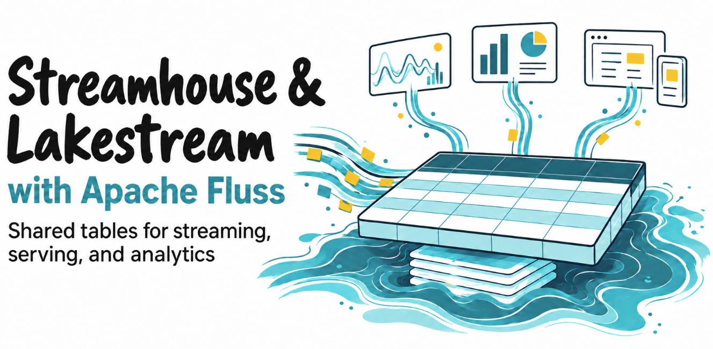

Most streaming architectures are designed around movement: get changes out of a source, process them, and deliver them somewhere useful. That works well until the same data has to support several different workloads. At that point, the architecture is no longer only about moving events, but  also about deciding where a reusable state should live and who should maintain it.

This is the problem behind Streamhouse. It organizes workloads around shared logical tables rather than around a collection of independently maintained destinations. Lakestream provides the stream–lake storage foundation underneath that model, coordinating fresh streaming data and historical lakehouse data as parts of one logical table.

<!-- truncate -->

### Why Streaming Data Platforms Maintain Repeated Copies Of Data
A common stream can feed several systems that independently maintain equivalent data. Each tracks ingestion progress, applies changes, propagates schemas, and recovers from failures. Their representations can differ in freshness even when they share a source.

Some copies serve a distinct purpose, such as a specialized index or workload isolation. Others exist because a consumer cannot access maintained data where it already lives. Those copies add repeated reconstruction and synchronization work.

The Streamhouse architecture makes reusable tables a platform resource with an owner and lifecycle. Compatible consumers share maintained data through supported interfaces. Physical replicas, caches, storage tiers, and purpose-built derived tables can still be necessary.

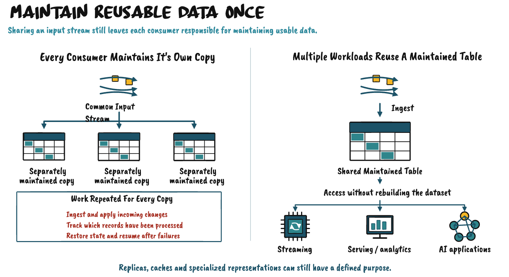

### What Defines The Streamhouse Architecture
> The Streamhouse architecture is an open, table-centric architecture that brings streaming, operational serving, and analytics onto a shared, lakehouse-native data foundation. It maintains reusable data as logical tables spanning fresh and historical data, so workloads can share maintained data without each reconstructing an equivalent copy.

The scope includes the full architecture: storage, compute engines, transformations, query and serving services, catalogs, governance, and applications. Those components have different responsibilities. Engines run computations; the foundation provides the shared tables on which those computations operate.

**Open** means that compatible components can participate through documented formats and supported APIs. **Shared** means that multiple workloads can use the same maintained tables. **Table-centric** means that identity, schema, and the meaning of records are defined at the table level. Consumers do not have to invent those interpretations independently.

**Lakehouse-native** describes how streaming and lakehouse storage relate. Historical data remains part of the logical table through coordinated metadata, data movement, and access. Exporting a stream into an unrelated lake table does not, by itself, establish this relationship.

The architectural property to look for is shared maintenance and reuse across fresh and historical data. A diagram containing a stream processor, a serving database, and a lakehouse tells us which technologies are present. We still need to understand whether their workloads share maintained tables or depend on separate copies synchronized by pipelines.

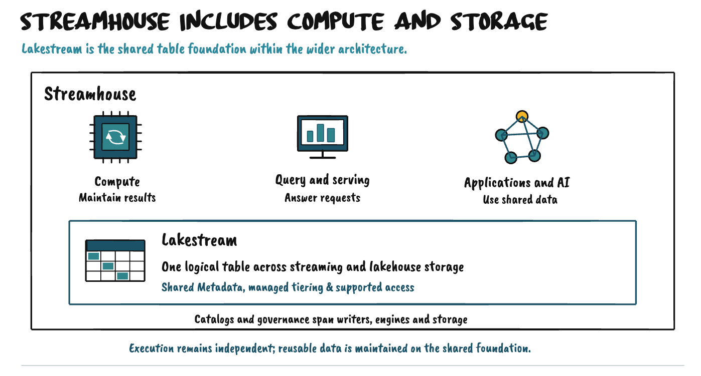

### From Topic-centric Movement To Table-centric Access
A topic-centric architecture organizes data around event movement: producers publish records, and consumers receive or replay them. A table-centric architecture organizes data around shared datasets with schemas, defined row semantics, and supported access paths. The distinction concerns what the foundation makes directly usable by a workload.

**Topics provide a distribution abstraction**. They decouple producers from consumers and can retain records for replay. Their core operations concern publishing and consuming records. When a workload needs a queryable current state, it commonly builds that representation in a processing application or downstream store. Sharing the event flow does not automatically share the resulting dataset.

**A topic does not, by itself, define a table schema or primary-key semantics**. Records may carry structured payloads and keys, with schema tooling around them. A record key may guide routing or retention, but it does not by itself define a current row, apply a row update, or expose a primary-key lookup. Interpreting fields and maintaining queryable rows requires additional capabilities beyond record delivery.

**Tables make the dataset part of the shared interface**. The foundation understands columns, types, and the operations defined for the table. Where primary keys are supported, keys identify rows and give updates and deletes their meaning. Compatible engines and applications can use maintained data through supported table access, without first creating an equivalent destination. Append-only tables also benefit from a defined schema and direct table access.

| Architectural Question | Topic-centric | Table-centric |
| --- | --- | --- |
| Core abstraction | Publish, retain, consume, and replay records. | Maintain and access shared datasets. |
| Schema | Payload schemas can be supplied by tooling; the topic itself does not define typed table columns. | Columns and types are part of the shared table definition. |
| Keys | Record keys may support routing or retention; they do not themselves expose row operations. | Where supported, primary keys identify rows and define update and delete semantics. |
| Queryable data | Commonly materialized by applications or downstream stores. | Available through supported table interfaces and compatible query engines. |
| Another workload | May build and maintain another representation of the same input. | Can reuse the maintained dataset where its interfaces meet the requirement. |

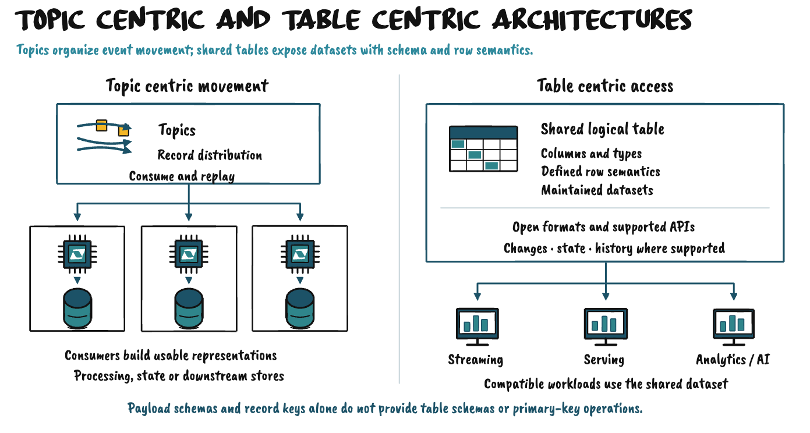
The shift extends beyond the location of state. The platform exposes an identifiable dataset that several workloads can understand and access. Schema, row semantics, and supported operations are properties of that shared dataset. Consumers can build on those properties instead of independently turning a delivered event stream into the same usable representation.

**The business value comes from reuse of an understood dataset.** Teams define what its rows represent, how it is derived, and who owns it. When that dataset remains accessible beyond its producing job, other teams can use the same definitions and computed results. Tables provide a structure for this reuse; their name or schema alone does not establish business meaning or quality.

**Open access** lets compatible engines use shared data through supported APIs and formats. Query engines still execute queries, and transformations still run in compute engines. Their reusable outputs can become shared tables, while windows, timers, and intermediate execution state remain private to the computation.

Changes, current state, and history are distinct access needs. Table type, integration, and retention determine what is available; a lake snapshot does not preserve every intermediate change. Lakestream extends the shared table across fresh streaming and historical lakehouse storage. Streamhouse organizes workloads around that coordinated foundation, making reusable data available throughout its lifecycle.

### How Storage & Compute Support Applications
Sources enter through supported writers and connectors. Ingestion establishes how records become table data, including their schema and append, update, or delete semantics. The shared foundation maintains the table and exposes the access paths available for it.

Compute engines read those tables and perform transformations. An ingested table becomes an enriched or aggregated table through an explicit computation. The engine owns that computation; it writes the reusable result back to the foundation. Several layers of derived tables can therefore coexist without making storage itself responsible for business transformations.

Query and serving engines access shared tables to answer analytical or application requests. Operational services can also use supported direct table interfaces where those interfaces meet their needs. Shared storage does not automatically supply every index, transaction model, or latency characteristic an application might require.

AI applications participate through the same access layer. Retrieval services or query tools can obtain maintained context from shared tables, including fresher data where the integration supports it. The AI application still owns prompt construction, retrieval policy, decision logging, and any additional indexes it needs. The architectural contribution is reusable data underneath those services.

Catalogs make table identities, schemas, and access information discoverable. Governance establishes ownership and permissions across writers, engines, and storage. These responsibilities span the architecture, even when the individual components deploy and scale independently.

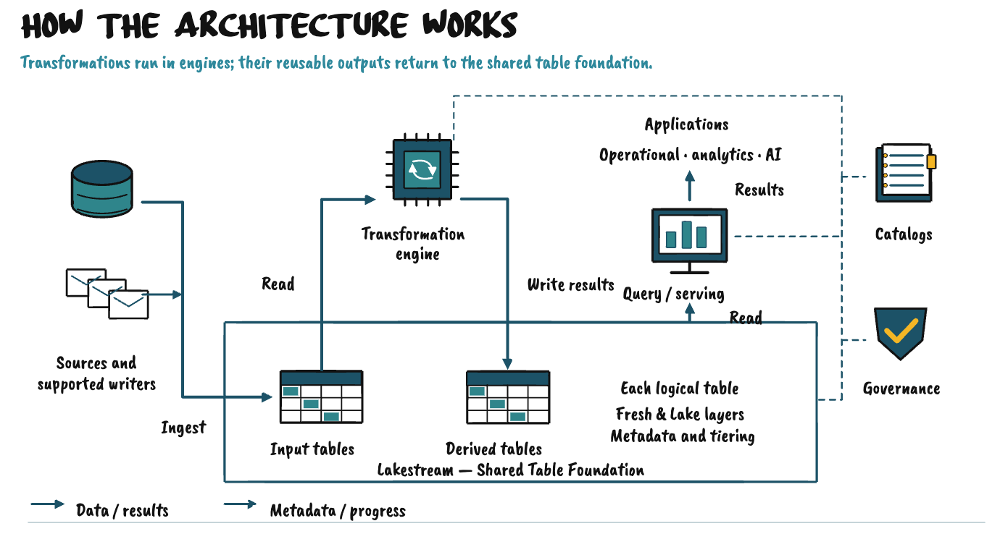

### Lakestream Unifies Data Lakes & Streams
> Lakestream is Streamhouse’s open table storage foundation, unifying fresh data in streams and historical data in open lakehouse tables as different freshness layers of one logical table.

Shared table metadata, managed tiering, and supported access across the layers maintain that relationship. Open formats and APIs allow compatible engines to read and write through supported interfaces. The name describes the unification of lakes and streams; Streamhouse describes the wider architecture built around that foundation.

**One logical table** means that the system maintains a coordinated identity and interpretation across physical representations. It does not require a single file layout, storage engine, endpoint, or physical copy. Streaming storage can optimize for continuous changes and fresh access, while lakehouse storage can optimize for scans and longer retention.

Freshness describes how far each representation has progressed through the incoming changes. The streaming layer may expose changes that have not yet been committed to the lake. As tiering advances, the lake representation incorporates more of those changes.

This is not a permanent division between recently created records and old records. A new update can change a key that has existed for years. The two physical representations may overlap, and a supported read must interpret them using the table’s semantics.

A lake-only query observes committed lake data. A supported union read accesses the relevant data across both layers. Both relate to the same logical table, but their freshness and execution behavior can differ.

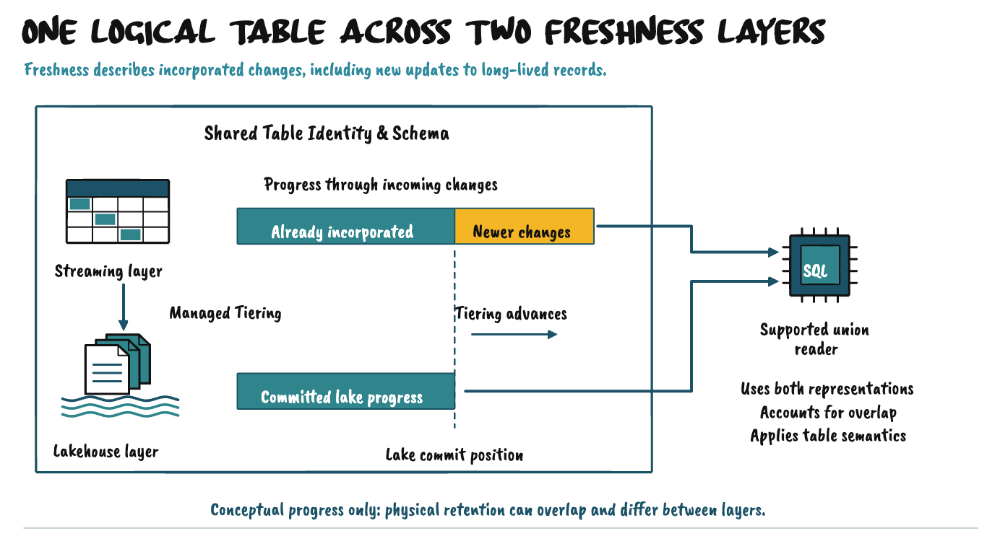

### How Metadata & Tiering Coordinate Reads
Three mechanisms connect the layers. **Shared metadata** identifies the table, defines its schema, and maps its representations. Relevant properties include partitioning, physical organization, and progress. A streaming bucket layout and a lake partition layout need a defined relationship; they need not be physically identical.

**Managed tiering** maintains the lake representation from streaming data. It determines what work remains, writes the relevant data, and commits it through the lake format. Successful progress must be associated with the committed lake representation so readers and recovery processes can use it. Files written without a completed commit are not equivalent to a readable table update.

**Supported union reads** use that relationship to determine what to read from each layer. Conceptually, a reader identifies the committed lake representation and its corresponding streaming progress, then obtains the additional streaming data needed for the requested view. Progress links the two sources and prevents the application from having to guess where one representation ends and the other continues.

The reader must also respect the table type. For append-only data, the selected ranges must avoid gaps or repeated records caused by physical overlap. Mutable tables additionally require the applicable handling of versions, updates, and deletes. A combined current-state view cannot be produced merely by appending every row returned by both sources.

The precise algorithm depends on the implementation and read mode. A streaming reader may initialize from a lake snapshot and continue from aligned stream positions; a bounded read may combine the relevant representations for its requested result. Neither pattern implies a universal, simultaneous snapshot across every table and engine.

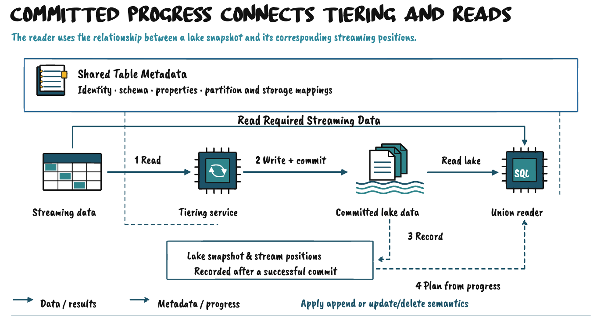

### How Independent Engines Read & Write Shared Tables
Openness makes the foundation usable beyond one engine. Open lakehouse formats expose a durable representation, streaming APIs expose supported access to fresh data or changes, and catalog integrations make tables discoverable. Together, these interfaces let teams change or add compute engines without requiring each engine to create and maintain its own copy of the data.

The access paths have different capabilities. A streaming consumer can use the streaming interface. A lake-compatible engine can read a committed lake representation. An engine with the required union-read integration can access both layers with their coordination information. Supporting an open lake format alone does not provide that integration.

Writing needs the same precision. A supported writer must preserve the table’s update and commit semantics. In a managed stream–lake design, application writes normally enter through the designated table interface, while tiering maintains the corresponding lake representation. Any other write path must be explicitly supported by the implementation.

This distinction matters for schema evolution as well. Changing a managed lake table independently can invalidate the mapping on which ingestion, tiering, or readers depend. Ownership and permitted operations must be clear even when the underlying format is open.

The practical promise is that a compatible engine can participate without automatically creating another engine-owned copy. It is not a promise that all engines support every operation or that arbitrary writes to either physical layer remain coordinated. Engine choice should follow the required access pattern, table semantics, freshness, and performance.

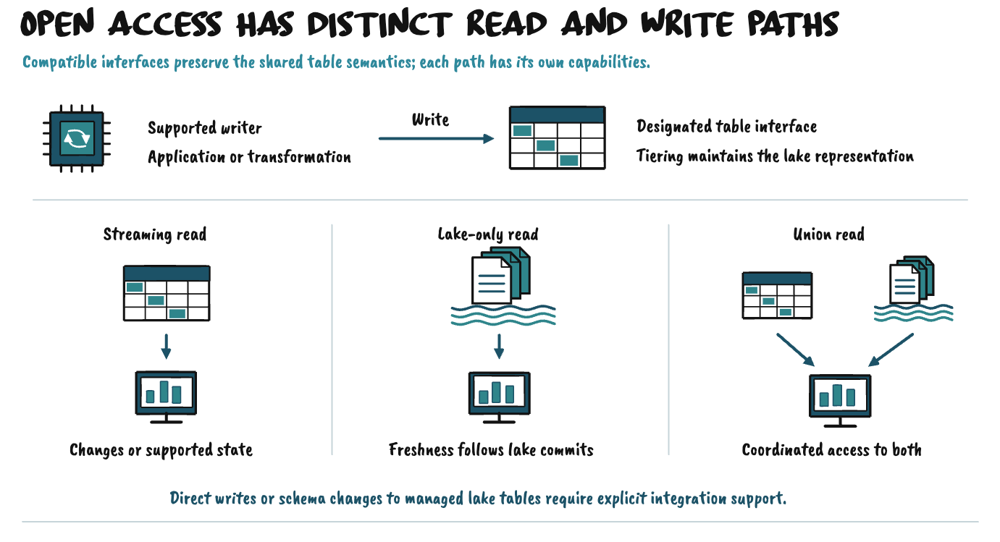

### How Apache Fluss Enables The Shared Foundation
Apache Fluss provides the streaming table layer and lakehouse integration for a concrete implementation of this architecture. Within that design, Lakestream names the coordinated stream–lake storage foundation. Fluss is the enabling technology; Streamhouse includes the engines and applications built around it.

Fluss’s [Lakestream](https://fluss.apache.org/docs/next/streaming-lakehouse/overview/) connects streaming tables to open lakehouse storage. Its [tiering service](https://fluss.apache.org/docs/next/streaming-lakehouse/tiering-service/) runs as an Apache Flink job: it reads Fluss data, writes and commits the lake representation, and records the associated progress. This is a storage maintenance responsibility implemented by a running service. Describing Lakestream as a storage foundation does not mean that its maintenance happens without computation.

Separately, Flink jobs can perform application transformations and publish shared result tables. Query engines and serving services access Fluss, the lake representation, or both through supported integrations. The [union-read](https://fluss.apache.org/docs/next/streaming-lakehouse/union-read/) documentation explains how those access patterns relate.

The diagram separates these responsibilities: transformation compute, streaming storage, tiering, lakehouse storage, and readers that can access both freshness layers. Exact capabilities depend on the Fluss release, table type, lake format, and engine integration.

The wider architectural definition is independent of a product list. A platform should be evaluated by whether it provides the required shared-table behavior and whether workloads can use it effectively. Adding Fluss to a collection of otherwise independent stores does not automatically consolidate the data those workloads maintain.

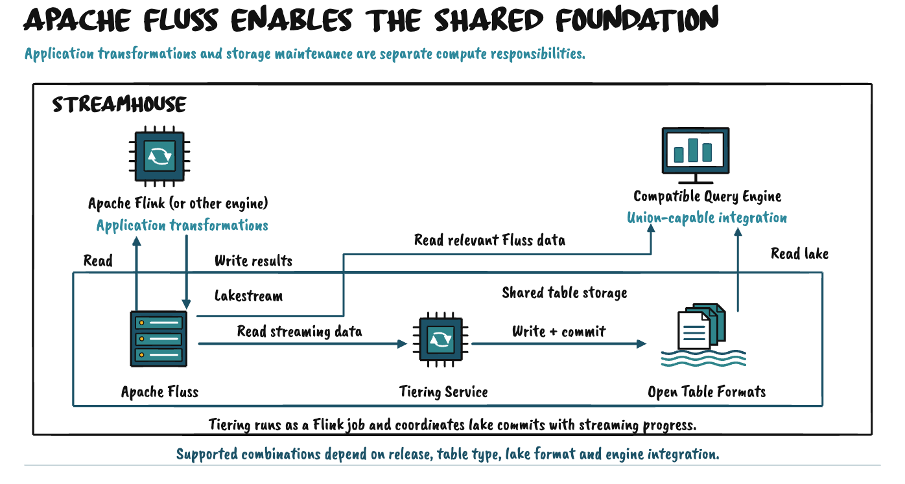

### The Benefits & Responsibilities Of Shared Storage
Shared maintenance can reduce repeated ingestion, reconstruction of equivalent state, and synchronization between destinations. A maintained transformation becomes more valuable when additional workloads can reuse its output. The amount saved depends on which existing copies the supported access paths can actually replace.

Responsibility also becomes more concentrated. Several consumers may depend on the same storage, metadata, and maintenance services. Capacity management, workload isolation, availability, access control, and recovery therefore become platform concerns. Independently deployed compute can still contend for shared storage resources.

Some responsibilities remain local. A transformation team owns the correctness and recovery of its computation. An application team owns application behavior, query choices, and any justified specialized materializations. The platform owns the shared table services and must make their guarantees understandable to those teams.

Freshness deserves its own measurement. A query can return quickly while reading a lake snapshot that trails the streaming layer. Query latency, ingestion progress, tiering progress, and the freshness of a derived table describe different things. A useful service objective should state both how quickly a workload gets an answer and how current that answer must be.

Those requirements also determine when a shared representation is not enough on its own. Caches and specialized copies can still improve the design where a workload needs a specific index, lower latency, or stronger isolation. Their purpose should be explicit, together with their refresh or invalidation behavior and ownership. The goal is not to eliminate every copy, but to avoid repeated maintenance where shared access already meets the workload’s needs.

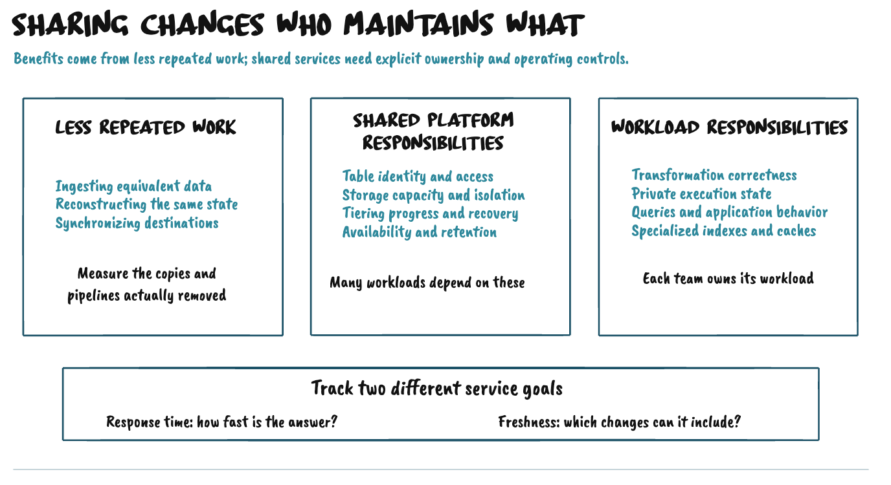

### What Makes Shared Tables A Streamhouse Architecture
The defining property is that independent workloads can reuse maintained logical tables whose fresh and historical representations are coordinated by the foundation.

**Shared maintenance** gives reusable data a life beyond an individual consumer. Streaming, serving, and analytical workloads can use maintained tables through suitable interfaces. A new workload does not automatically require another equivalent state store and synchronization pipeline.

**Stream-Lake coordination** makes fresh and historical data parts of the same logical table. Shared metadata establishes their identity and meaning. Managed tiering maintains the lake representation, and supported readers use committed progress to interpret the layers together. The foundation and its integrations own that coordination, so each application does not have to implement it independently.

**Independent compute and open access** make the shared tables useful across workloads. Compatible engines read inputs, run transformations, and publish reusable results through supported interfaces. Private execution state remains an engine responsibility. The formats and APIs allow participation beyond a single engine, with explicit capabilities for each access path.

These properties work together. Open formats, catalogs, and union readers contribute access, discovery, and coordination. Streamhouse combines them with shared table maintenance and reuse across workloads.

Lakestream supplies the coordinated open table foundation. Streamhouse includes the compute, transformations, serving, analytics, and applications organized around it. A platform can apply this design to particular datasets and workloads, reducing equivalent maintenance while retaining specialized copies that serve a distinct purpose.

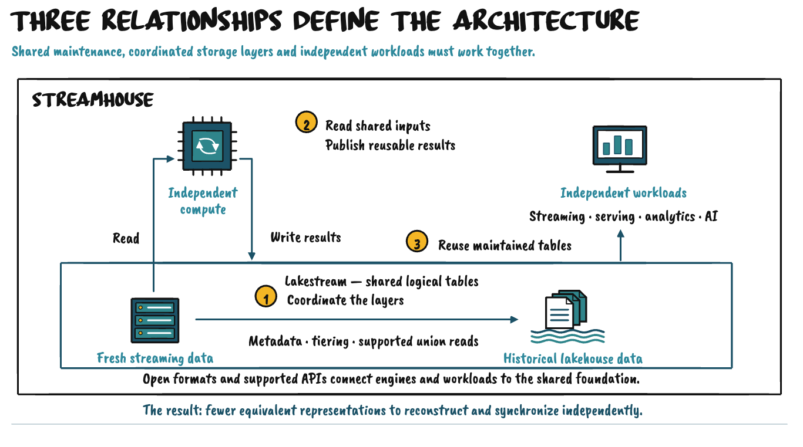

**Streamhouse** is not defined by putting streaming, serving, and lakehouse technologies in the same architecture. The distinction is whether workloads can reuse maintained logical tables across fresh and historical data instead of each reconstructing equivalent state.

**Lakestream** provides the stream–lake foundation for that model. Apache Fluss provides a concrete implementation through streaming tables, managed lake tiering, shared metadata, and supported reads across fresh and historical representations, while compute and serving engines remain independent around that foundation.

This does not remove the need for caches, indexes, or workload-specific stores. Those remain useful when they provide a distinct capability. The goal is to avoid another maintained copy when the shared table already meets the requirement.

**A useful test is:** When a new workload arrives, can it reuse the maintained state through the shared table interfaces, or does the architecture require it to reconstruct and synchronize an equivalent representation of that state?
